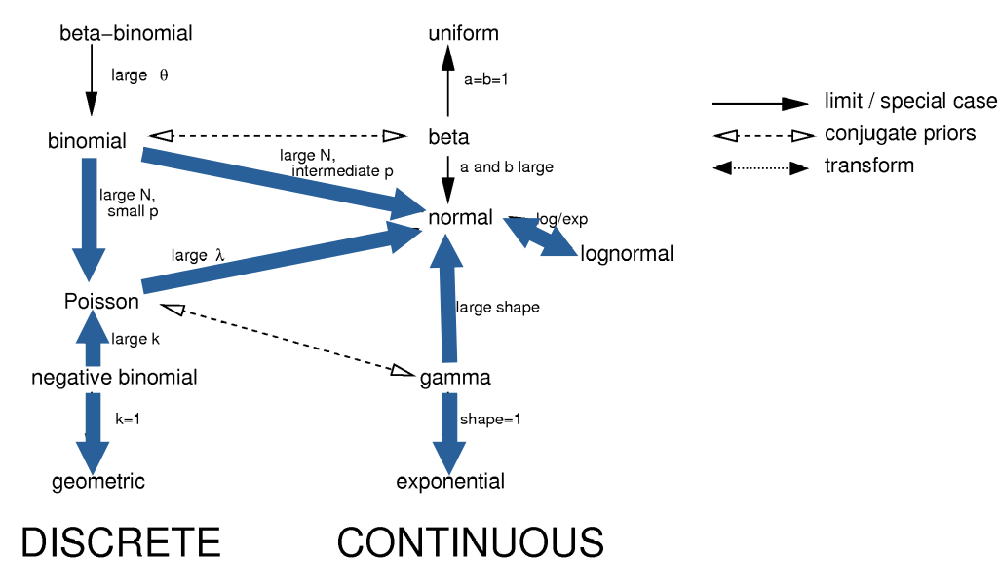

```{r setup, include=FALSE}
options(htmltools.dir.version = FALSE)
options(servr.daemon = TRUE)#para que não bloqueie a sessão
knitr::opts_chunk$set(prompt = TRUE, comment = "", eval = TRUE, echo = FALSE, warning = FALSE, message = FALSE)
library(ggplot2)
library(ggthemes)
library(dplyr)
library(tidyr)
library(latex2exp)
library(ggridges)
library(viridis)
library(knitr)
library(kableExtra)
```

```{r xaringan-themer, include=FALSE, warning=FALSE}

style_solarized_light(
  title_slide_background_color = "#586e75",# base 3
  header_color = "#586e75",
  text_bold_color = "#cb4b16",
  background_color = "#fdf6e3", # base 3
  header_font_google = google_font("DM Sans"),
  text_font_google = google_font("Roboto Condensed", "300", "300i"),
  code_font_google = google_font("Fira Mono"), text_font_size = "28px",
  code_font_size="1rem"
)
xaringanExtra::use_share_again()
xaringanExtra::use_fit_screen()
xaringanExtra::use_tachyons()
xaringanExtra::use_tile_view()

## clipboard
htmltools::tagList(
  xaringanExtra::use_clipboard(
    button_text = "Copiar código <i class=\"fa fa-clipboard\"></i>",
    success_text = "Copiado! <i class=\"fa fa-check\" style=\"color: #90BE6D\"></i>",
    error_text = "Não copiado 😕 <i class=\"fa fa-times-circle\" style=\"color: #F94144\"></i>"
  ),
  rmarkdown::html_dependency_font_awesome()
)

## ggplot theme
theme_publication <- function(base_size=14, base_family="helvetica") {
    (theme_foundation(base_size=base_size, base_family=base_family)
        + theme(plot.title = element_text(face = "bold",
                                          size = rel(1.2), hjust = 0.5),
                text = element_text(),
                panel.background = element_rect(colour = NA),
                plot.background = element_rect(colour = NA),
                panel.border = element_rect(colour = NA),
                axis.title = element_text(face = "bold",size = rel(1)),
                axis.title.y = element_text(angle=90,vjust =2),
                axis.title.x = element_text(vjust = -0.2),
                axis.text = element_text(), 
                axis.line = element_line(colour="black"),
                axis.ticks = element_line(),
                panel.grid.major = element_line(colour="#f0f0f0"),
                panel.grid.minor = element_blank(),
                legend.key = element_rect(colour = NA),
                legend.position = "bottom",
                legend.direction = "horizontal",
                legend.key.size= unit(0.2, "cm"),
                ##legend.margin = unit(0, "cm"),
                legend.spacing = unit(0.2, "cm"),
                legend.title = element_text(face="italic"),
                plot.margin=unit(c(10,5,5,5),"mm"),
                strip.background=element_rect(colour="#f0f0f0",fill="#f0f0f0"),
                strip.text = element_text(face="bold")
                ))
    
}

```

## Conceitos

+ Variáveis aleatórias

+ Funções de densidade de probabilidade

+ Distribuições de probabilidade como modelos estatísticos ($p(y \mid \theta)$)

+ A distribuição normal de probabilidade

+ Teorema central do limite

+ Método dos mínimos quadrados

---

## Um conjunto de dados experimentais


.pull-left[

* Coleta de populações de *Drosophila melanogaster* em 18 locais na Austrália.
* Linhagens isofêmeas: progênie separadas de cada fêmea coletada,
  obtida de 10 gerações em laboratório.
* 50 larvas das linhagens de cada população mantidas a
  18°C, 25°C e 29°C durante o desenvolvimento (3 réplicas por tratamento).
* Condições controladas de laboratório: frascos, meio de cultura, fotoperíodo,
  temperatura, densidade de moscas, etc.
* Medição das moscas adultas nascidas sob cada tratamento.

]

.pull-right[
.center[


]

.right[

Van Heerwaarden & Sgrò, *Evolution* (2011).]

]

---

## Um conjunto de dados experimentais


```{r drosophila thorax length data}

dthor <- read.csv("42_Van_Heerwaarden_&_Sgro_2011_Dmelanogaster_thorax_length.csv")
## Sample means
dthor.m <-
    dthor %>%
    filter(Sex == "female", Temperature == "25") %>%
    group_by(Population) %>%
    summarise(th.mean = mean(Thorax_length, na.rm=TRUE)) %>%
    arrange(th.mean) %>%
    as.data.frame()
```

.pull-left[

* 30 adultos sorteados entre as moscas criadas em
  cada temperatura.
* Os histogramas mostram as frequências de moscas em classes de comprimento do tórax
para cada população, apenas para fêmeas criadas a 25°C.
* As linhas azuis são as médias do comprimento do tórax de cada amostra.
]


.pull-right[
.center[

```{r drosophila pops histogram}
p.dros <-
    dthor %>%
    filter(Sex == "female", Temperature == "25") %>%
    mutate(pop = factor(Population, levels = dthor.m$Population)) %>%
    ggplot(aes(x = Thorax_length)) +
    geom_histogram(bins = 8, alpha =0.3) +
    geom_vline(data = dthor.m, aes(xintercept = th.mean), color = "blue", size = 1.5) +
    xlab("Comprimento do tórax (mm)") +
    ##geom_density() +
    facet_wrap(~ Population) +
    theme_publication(18)
p.dros
    
```
]
]

---

## Distribuição das médias amostrais

.pull-left[
.center[

```{r }

p.dros
    
```
]
]

.pull-right[
.center[


```{r drosophila-mean-hist}

p.dros2 <-
    dthor.m %>%
    ggplot(aes(th.mean)) +
    geom_histogram(binwidth = 0.013, alpha =0.5) +
    geom_rug(col = "blue", size =1.1) +
    xlim(0.97, 1.1) +
    xlab("Comprimento médio do tórax (mm)")+
    ylab("Contagem (nº de populações)") +
    ggtitle("Distribuição das médias populacionais") +
    theme_publication(18)

p.dros2
```

]]


---


## Variáveis aleatórias

.pull-left[

* Muitos valores são possíveis, mesmo para médias de medidas tomadas
  exatamente da mesma forma e sob condições fortemente controladas.

* Medidas científicas são **variáveis aleatórias**: quantidades que
  são inevitavelmente afetadas por eventos aleatórios.

* Como lidar com isso? Com modelos que nos dizem qual é a chance de
observar cada valor possível da medida.

* Em outras palavras, construindo **distribuições de probabilidade**.

]

.pull-right[
.center[


```{r }
p.dros2
```

]]

---

## 1º passo: a escala de densidade

.pull-left[


* Vamos reescalonar o eixo y deste histograma para que a área total
  do histograma seja igual a um.
* Ou seja, expressamos as frequências (ou contagens) originais em uma nova
  escala, de modo que a soma das áreas das barras seja igual a um. Chamamos
  essa escala de **densidade**.
* Este é um reescalonamento linear (ou seja, proporcional), então a forma do
  histograma não muda.

]

.pull-right[
.center[


```{r}
p1 <-
    dthor.m %>%
    ggplot(aes(th.mean)) +
    geom_histogram(aes(y=after_stat(density)), binwidth = 0.013, alpha =0.5) +
    xlim(0.97, 1.1) +
    xlab("Comprimento médio do tórax (mm)")+
    ylab("Densidade") +
    ggtitle("Distribuição das médias populacionais") +
    theme_publication(18)

p1 + geom_rug(col = "blue", size =1.1)

```

]]

---

## 2º passo: a função de densidade

.pull-left[

* Agora vamos imaginar como "suavizar" a distribuição de densidades,
  usando uma função contínua.
* Pense nessa função como a representação contínua (ou um limite
  contínuo) do histograma. Essa é a **função de densidade**.
* A área sob a curva de uma função de densidade é igual a um.

]


.pull-right[
.center[


```{r}

p1  + geom_density(color = "blue", size = 1.5)

```

]]


---


## Função de densidade: algumas definições

.pull-left[

* A função de densidade é uma função matemática contínua $f(x)$ que retorna um valor de
  densidade para qualquer valor da medida $x$.
* Chamamos de **espaço amostral** ( $\Omega$ ) o conjunto de todos os valores que uma
  variável aleatória pode assumir.


]


.pull-right[
.center[


```{r}
dmd <- density(dthor.m$th.mean)
tmp <- data.frame(x = dmd$x, y = dmd$y)
index <- min(which(tmp$x > 1.015, arr.ind = TRUE))
p2 <-
    dthor.m %>%
    ggplot(aes(th.mean)) +
    geom_density(color = "blue", size = 1.5) +
    xlim(0.97, 1.1) +
    xlab("Comprimento médio do tórax (mm)")+
    ylab("Densidade") +
    ##ggtitle("Distribuição das médias populacionais") +
    theme_publication(18)

p2  +
    geom_segment(aes(x = x , xend = x, y = 0, yend =y),
                 data = tmp[index,], col = "red",
                 linetype = "dashed", size = 1.1) +
    geom_segment(aes(x = x, xend = 0.97, y = y, yend =y),
                 data = tmp[index,], col = "red",
                 linetype = "dashed", size = 1.1)

    
```

]]


---

## Função de densidade e probabilidades

.pull-left[


* A integral de $f(x)$ sobre o espaço amostral é igual a um.

* Essa é uma forma matemática de dizer que a área sob $f(x)$ é igual a um.

]

.pull-right[
.center[
```{r}
p2 +
    geom_ribbon(aes(x=x, ymin=0, ymax =y),
                data = tmp,
                fill = "blue", alpha =.5) +
    geom_segment(aes(x=1.05, xend=1.065, y= 13, yend = 15), arrow = arrow()) +
    annotate("label", x = 1.087, y = 15, label = TeX(r"($\int_{\Omega} f(x) \, dx = 1$)", output = "character"),
             parse = TRUE, size = 7)

```
]]

---

## Função de densidade e probabilidades

.pull-left[


* A área sob $f(x)$ para qualquer intervalo $L \leq x \leq U$ é uma
  fração da área total sob $f(x)$.

* Essa área é uma expressão matemática da **probabilidade atribuída
  a um intervalo de medidas**. Ela também é uma integral definida da função
  de densidade:

$$ P(L \leq x \leq U) ~ = ~ \int_L^U f(x) \, dx $$

]

.pull-right[
.center[
```{r}
p2 +
    geom_ribbon(aes(x=x, ymin=0, ymax =y),
                data = filter(tmp, x>1.04&x<1.08),
                fill = "blue", alpha =.5) +
    geom_segment(aes(x=1.05, xend=1.067, y= 13, yend = 15), arrow = arrow()) +
    annotate("label", x = 1.087, y = 15, label = TeX(r"($\int_{1.04}^{1.08} f(x) \, dx)", output = "character"),
             parse = TRUE, size = 7)

```
]]

---


## Distribuições de probabilidade como modelos


* A função de densidade que definimos é usada para expressar
  probabilidades de variáveis aleatórias, ou seja, uma **distribuição
  de probabilidade**.

--

* É um modelo que atribui probabilidades aos dados, isto é, aos
  valores de uma variável aleatória.

--

* No nosso exemplo, a variável aleatória é o comprimento médio do tórax que
  obtivemos a partir de amostras de 30 moscas.

--

* Com esse tipo de modelo, podemos fazer muitas perguntas interessantes sobre
  essas médias amostrais, como:


---

class: center, middle

### Qual é a probabilidade de um comprimento médio do tórax de até 1,04 mm?

```{r}

p2 +
    geom_ribbon(aes(x=x, ymin=0, ymax =y),
                data = filter(tmp, x>0.96&x<1.04),
                fill = "blue", alpha =.5)
```

---

class: center, middle

### Qual é o intervalo de confiança para o comprimento médio do tórax?

```{r}

p2 +
    geom_ribbon(aes(x=x, ymin=0, ymax =y),
                data = filter(tmp, x>0.995&x<1.07),
                fill = "blue", alpha =.5) +
    geom_vline(xintercept = 0.995, col = "red", linetype = "dashed", size = 1.1) +
    geom_vline(xintercept = 1.07, col = "red", linetype = "dashed", size = 1.1) +
    geom_segment(aes(x=0.995, xend = 1.07, y = 26.5, yend = 26.5),
                 arrow = arrow(ends = "both"),
                 col = "red") +
    annotate("label", x = 1.035, y = 26.5, label = "IC 95%", size = 7) 
```


---

class: center, middle

### Qual é o valor esperado teórico desta distribuição?


```{r}
th.m <- mean(dthor.m$th.mean)
p2 +
    geom_vline(xintercept = th.m, col = "red", linetype = "dashed", size = 1.1) +
    geom_segment(aes(x = th.m + 0.002, xend=1.068, y= 12.5, yend = 15), arrow = arrow()) +
    annotate("label", x = 1.087, y = 15, label = TeX(r"($\int x \cdot f(x) \;  dx)", output = "character"),
             parse = TRUE, size = 7)
```

---

## Qual distribuição de probabilidade?


* Agora sabemos que distribuições de probabilidade são uma boa escolha para
  modelar variáveis aleatórias. Mas como construir um modelo desses?

--

* Há receitas para isso, mas muitas distribuições de probabilidade
  já foram propostas, para uma enorme variedade de tipos de dados.

--

* No nosso exemplo, nossa variável aleatória são médias amostrais. O **Teorema
  Central do Limite** afirma que as médias amostrais seguem uma distribuição
  Normal à medida que o tamanho das amostras aumenta.
  
--

* Esse é um dos resultados mais importantes da teoria da probabilidade. Temos
  ótimas razões para escolher a distribuição Normal como nosso
  modelo estatístico.

---

## A distribuição Normal

.pull-left[

* Criada para descrever a distribuição de erros de medida aditivos.
* O TCL nos diz que este é um bom modelo para qualquer variável aleatória que seja
a soma de muitas outras variáveis aleatórias.
* É uma distribuição simétrica, sempre em forma de sino.
* Tem dois parâmetros, que correspondem à média e ao desvio-padrão
  da distribuição.
* Sua média e seu desvio-padrão são independentes.
]

.pull-right[
.center[

```{r normal-curve}

ggplot(data.frame(x = c(-4, 4)), aes(x = x)) +
    stat_function(fun = dnorm, col = "blue", size = 1.5) +
    annotate("label", x = 2.6, y = 0.35,
             label = TeX(r"($f(x) \, = \, \frac{1}{\sigma \sqrt{2\pi}} \; e^{- \frac{1}{2} \left( \frac{x-\,\mu}{\sigma} \right)^2} $)",
                         output = "character"),
             parse = TRUE, size = 6) +
    xlab("x") +
    ylab("Densidade") +
    ggtitle("Função de densidade de probabilidade Normal") +
    theme_publication(18)
```

]]

---


## Parâmetro de posição da distribuição Normal


.pull-left[

* A Normal tem um **parâmetro de posição**, que chamaremos de $\mu$.
* Esse parâmetro corresponde à média da distribuição Normal.
* Ao mudar $\mu$, mudamos a posição da distribuição Normal
ao longo do eixo x, sem alterar o desvio-padrão.
]

.pull-right[
.center[
	```{r normal-location}
    
    df1 <- data.frame(
        case_number = factor(1:5),
        caseMean = c(-4, -2, 0, 2, 4),
        caseSD = 1
    )
    
    n <- 100
    df3 <-
        df1 %>%
        mutate(low  = caseMean - 3 * caseSD, high = caseMean + 3 * caseSD) %>%
        uncount(n, .id = "row") %>%
        dplyr::mutate(x    = (1 - row/n) * low + row/n * high, 
                      norm = dnorm(x, caseMean, caseSD))
    
    ggplot(df3, aes(x, factor(case_number), height = norm, color = case_number)) +
        geom_ridgeline(scale = 3, aes(fill = case_number), alpha =0.5, linetype = 0) +
        xlim(-9,7) + 
        theme_publication(18) +
        theme(legend.position = "none",
              axis.line.y = element_blank(),
              axis.text.y = element_blank(),
              axis.ticks.y = element_blank(),
              axis.title.y = element_blank()
              ) +
        annotate("text", x = rep(-8.5,5),
                 y = 1:5 + 0.05,
                 label = c(TeX(r"($\mu = - 4$)"), TeX(r"($\mu = - 2$)"), TeX(r"($\mu = 0$)"),
                           TeX(r"($\mu = 2$)"), TeX(r"($\mu = 4$)")),
                 size = 6)
	```
]
]

---

## Parâmetro de escala da distribuição Normal

.pull-left[

* A Normal tem um **parâmetro de escala**, que chamaremos de $\sigma$.
* Esse parâmetro corresponde ao desvio-padrão da distribuição Normal.
* Ao mudar $\sigma$, mudamos a dispersão da distribuição Normal
em torno da média, sem alterar a média.
]


.pull-right[
.center[

```{r normal-scale}

df1 <- data.frame(
    case_number = factor(1:5),
    caseMean = 0,
    caseSD = rev(seq(0.5, 2.5,  by =0.5))
    )

n <- 100
df3 <-
    df1 %>%
    mutate(low  = caseMean - 3 * caseSD, high = caseMean + 3 * caseSD) %>%
    uncount(n, .id = "row") %>%
    dplyr::mutate(x    = (1 - row/n) * low + row/n * high, 
           norm = dnorm(x, caseMean, caseSD))

ggplot(df3, aes(x, factor(case_number), height = norm, color = case_number)) +
    geom_ridgeline(scale = 3, aes(fill = case_number), alpha =0.5, linetype = 0) +
    xlim(-9,7) + 
    theme_publication(18) +
    theme(legend.position = "none",
          axis.line.y = element_blank(),
          axis.text.y = element_blank(),
          axis.ticks.y = element_blank(),
          axis.title.y = element_blank()
          ) +
    annotate("text", x = rep(-8.5,5),
             y = 1:5 + 0.05,
             label = c(TeX(r"($\sigma = 2.5$)"), TeX(r"($\sigma = 2$)"), TeX(r"($\sigma = 1.5$)"),
                       TeX(r"($\sigma = 1$)"), TeX(r"($\sigma = 0.5$)")),
             size = 6)
```
]]

---

## Ajuste de modelos

.pull-left[

* Escolhemos um modelo estatístico para nossos dados

* Esse modelo tem dois parâmetros livres, $\mu$ e $\sigma$

* Que valores devemos escolher para esses dois parâmetros?

* Encontrar bons valores para os parâmetros de um modelo estatístico significa
  **ajustar um modelo aos dados**.
]


.pull-right[
.center[

```{r fitting-normal}

dt.m <- mean(dthor.m$th.mean)
dt.sd <- sd(dthor.m$th.mean)

plot.n <- function(mean, sd, ...)
    stat_function(fun = dnorm,
                  args = list(mean = mean, sd = sd),
                  xlim = c(mean - 3*sd, mean + 3*sd), ...)

p2 <-
    p1 +
    xlim(0.9, 1.15) +
    plot.n(dt.m-0.08, sd = dt.sd + 0.01, linetype = "dashed", color = "blue", size = 0.8) +
    plot.n(dt.m-0.02, sd = dt.sd + 0.05, linetype = "dashed", color = "blue", size = 0.8) +
    plot.n(dt.m, sd = dt.sd/2, linetype = "dashed", color = "blue", size = 0.8) +
    plot.n(dt.m + 0.08, sd = dt.sd*1.1, linetype = "dashed", color = "blue", size = 0.8) +
    theme(panel.grid.major = element_blank(),
          panel.grid.minor = element_blank())

p2 + plot.n(dt.m, sd = dt.sd, linetype = "dashed", color = "blue", size = 0.8)
    
```

]
]

---

## Ajuste de modelos

.pull-left[

* Ajustamos modelos estatísticos **estimando** o valor dos parâmetros,
  a partir dos dados observados.

* Há muitas formas de fazer isso. Em um dos métodos de ajuste que
  usaremos neste curso, as estimativas para ajustar uma distribuição normal são:
  
  * A média amostral como estimativa de $\mu$
  * O desvio-padrão amostral como estimativa de $\sigma$

]

.pull-right[
.center[

```{r fitting-normal_right_one}
p2  +plot.n(dt.m, sd = dt.sd, color = "red", size = 1.5)
```

]
]


---

## Um pouco de notação


* Nosso modelo: o comprimento médio do tórax $x$ segue uma distribuição normal:

$$ x \, \sim \, \text{Normal}(\mu, \sigma)$$

--

* A estimativa do parâmetro $\mu$ é a média dos valores de $x$ na amostra:

$$ \widehat{\mu} \, = \, \bar{x} \, = \, \frac{1}{N} \, \sum_{i=1}^N x_i $$


---


## Um pouco de notação


* A estimativa do parâmetro $\sigma$ é a raiz quadrada da variância dos valores de $x$ na amostra:

$$ \widehat{\sigma} \, = \, \sqrt{s^2} $$

* Em que a variância é a média dos desvios quadráticos em relação à média amostral:

$$ s^2 \, = \, \frac{1}{N} \, \sum_{i=1}^N (x_i - \bar{x})^2 $$ 

---

## Outras distribuições de probabilidade

.pull-left[
 
* A distribuição normal é muito usada, mas outras distribuições
   se ajustam melhor a diferentes variáveis aleatórias. Há muitos modelos para escolher.
* Escolher uma distribuição de probabilidade para descrever um conjunto de dados significa
   **formular uma hipótese sobre como seus dados são gerados**.
* Por exemplo, considere o número de crianças às quais foi atribuído o gênero masculino em 
   famílias de 12 filhos na Saxônia no século XIX (Geisller, 1889 *apud* Lindsey, 1995, Introductory Statistics).
]

.pull-right[
.center[
```{r saxony-data}

saxony <-
    data.frame(
        x = 0:12,
        y = c(3, 24, 104, 286, 670, 1033, 1343, 1112, 829, 478, 181, 45, 7)) %>%
    mutate(yobs = y/sum(y),
           ypred =  dbinom(x, size = 12, prob = 0.5),
           ypred2 = dbinom(x, size = 12, prob = sum(x*y)/(12*sum(y))))

    saxony %>%
        ggplot( aes(x, y)) +
        geom_col() +
        ggtitle("Frequência de famílias com 0 a 12 filhos homens") +
        xlab("Nº de crianças com gênero masculino atribuído ao nascer")+
        ylab("Frequência (nº de famílias)") +
        theme_publication()

```
]


]

---

## Um modelo simples para esses dados

.pull-left[

1. Cada família é um '*ensaio*' ou um '*experimento*' com 12 '*tentativas*'; 
2. Cada tentativa (um nascimento) tem apenas dois resultados possíveis: gênero masculino ou feminino atribuído ao recém-nascido;
3. As tentativas são independentes: o gênero de um recém-nascido não afeta o gênero dos nascimentos seguintes na família;
4. A probabilidade de cada resultado em cada tentativa é constante.
5. Essas premissas valem para a **distribuição binomial de probabilidade**

]

.pull-right[
.center[

```{r }
p.sax <-
    saxony %>%
    ggplot( aes(x, yobs)) +
    geom_col() +
    ggtitle("Proporção de famílias com 0 a 12 filhos homens") +
    xlab("Nº de crianças com gênero masculino atribuído ao nascer")+
    ylab("Proporção de famílias") +
    theme_publication()
p.sax
```

]
]

---

## A distribuição binomial de probabilidade

.pull-left[

* Atribui uma probabilidade a valores discretos (números inteiros, como contagens):
$$f(x) = {N\choose x} p^x (1 - p)^{N - x}$$
  * $N$ : número de tentativas em cada experimento
  * $p$ : probabilidade de 'sucesso' em cada tentativa
* $N$ geralmente é conhecido. Para ajustar uma distribuição binomial, precisamos estimar apenas $p$
]


.pull-right[
.center[

```{r }

bin.ex <-
    data.frame(
        x = rep(0:12, 5),
        grupo = factor(rep(c("p = 0.1","p = 0.3","p = 0.5","p = 0.7","p = 0.9"), each =13)),
        y = c(dbinom(0:12, size = 12, prob = 0.10),
              dbinom(0:12, size = 12, prob = 0.30),
              dbinom(0:12, size = 12, prob = 0.50),
              dbinom(0:12, size = 12, prob = 0.70),
              dbinom(0:12, size = 12, prob = 0.90))
        )

ggplot( bin.ex, aes(x, y, label = grupo)) +
    geom_col(aes(fill=grupo)) +
    geom_text(x=13.4, y=0.15, size = 6) +
    scale_x_continuous(breaks = 0:12, limits =c(0,13.5)) +
    facet_grid(grupo~.) +
    xlab("Número de sucessos") +
    ggtitle("Distribuição binomial, N = 12") +
    theme_publication() +
    theme(strip.background = element_blank(), strip.text.y = element_blank(), 
          strip.placement = "outside", panel.spacing.y = unit(0, "cm")) +
    theme(legend.position = "none",
              axis.line.y = element_blank(),
              axis.text.y = element_blank(),
              axis.ticks.y = element_blank(),
              axis.title.y = element_blank()
              )

```

]]

---

## Ajustando uma distribuição binomial aos dados

.pull-left[

* Um bom estimador de $p$ é a proporção observada de sucessos
  entre todas as tentativas. 
* No nosso exemplo, houve 38.100 
  crianças às quais foi atribuído o gênero masculino, em um total de 73.380 nascimentos, 
  ou seja, uma proporção observada de 0,519 de meninos.
* Os pontos vermelhos mostram as probabilidades atribuídas pela binomial com essa
  estimativa, o que sugere um viés em favor do gênero masculino.

]

.pull-right[
.center[

```{r }
p.sax +  geom_point(aes(y = ypred2), col = "red", size = 3)

```

]
]

---

## Algumas outras distribuições

### Discretas

* **Poisson**: contagens de eventos independentes a uma taxa constante (ex.: número de capturas de animais em armadilhas)
* **Binomial negativa**: o mesmo, para eventos agregados (ex.: número de árvores de uma espécie em parcelas florestais)
* **Geométrica**: número de tentativas antes que ocorra um evento com taxa constante (ex.: número de anos de vida)


---

## Algumas outras distribuições

### Contínuas

* **Log-normal**: produto de muitas variáveis aleatórias (ex.: tamanhos populacionais em dinâmicas de nascimento e morte)
* **Exponencial**: tempo contínuo até um evento com taxa constante (ex.: tempo até a falha de máquinas, tempo de vida)
* **Gama**, **Weibull**: como a exponencial, mas com a taxa do evento variando em função do tempo (ex.: tempo de vida com envelhecimento)
* **Uniforme**: valores equiprováveis (útil como modelo nulo ou para gerar outras distribuições)

---


## Muitas distribuições são relacionadas entre si

.center[

```{r, echo=FALSE, out.width="70%",}

```
]

.right[
Bolker,2008
Veja também (http://www.johndcook.com/distribution_chart.html)
]

---

## Mensagens para levar para casa

1. Distribuições de probabilidade atribuem
   probabilidades a cada valor possível de uma medida.

--

2. Assim, distribuições de probabilidade podem ser concebidas como modelos do
   processo que gera os dados em questão.

--

3. Ajustamos um modelo estatístico encontrando valores razoáveis para os
   parâmetros das distribuições de probabilidade.

---

## Referências

+ Bolker, B.M. 2008 Ecological Models and Data in R. Princeton:
    Princeton University Press.

+ Gotelli, N.J., Ellison, A.M., Ellison, S.E., 2004. A Primer of
  Ecological Statistics. Sinauer Associates Publishers.

+ McElreath, R., 2018. Statistical Rethinking: A Bayesian Course with
  Examples in R and Stan, 2nd ed. CRC Press.


