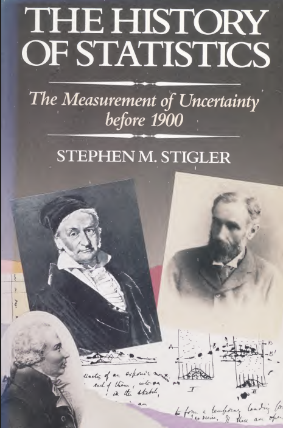
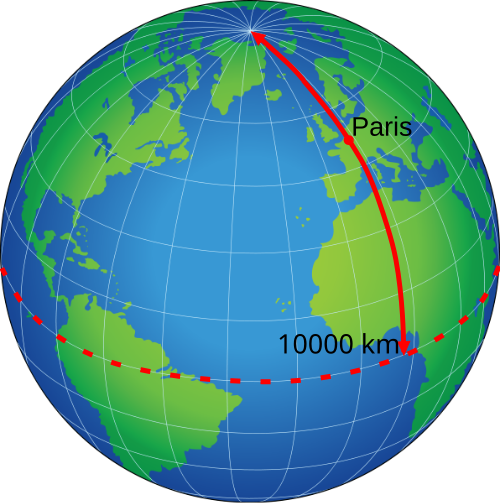
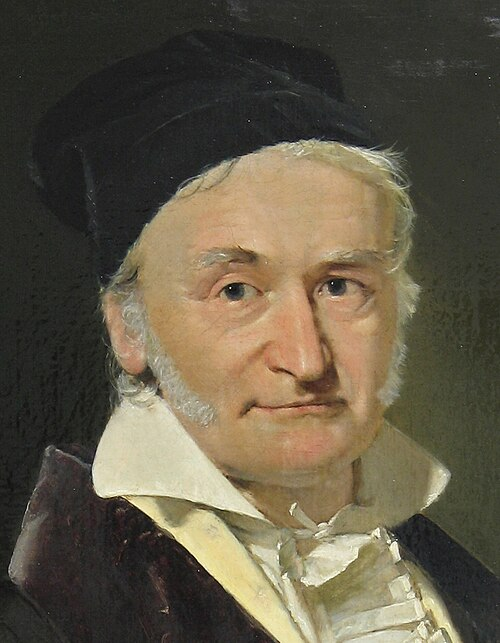
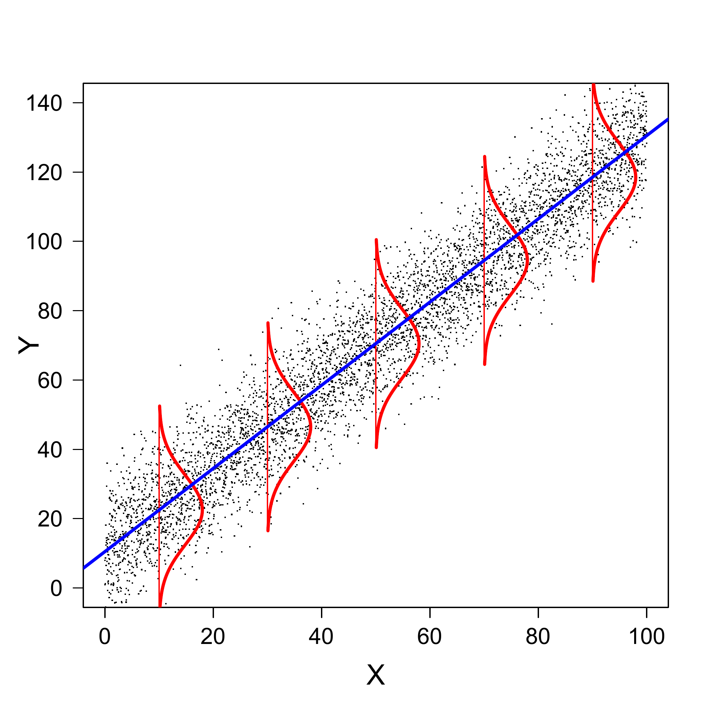
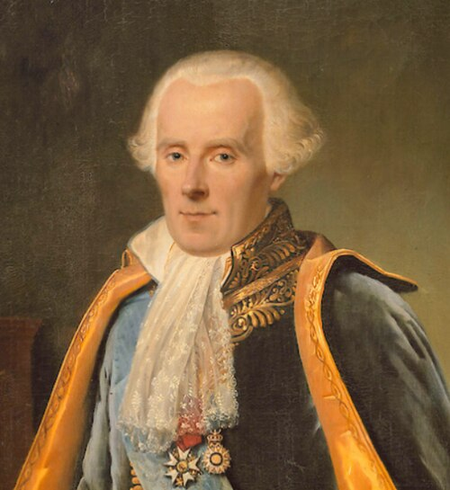
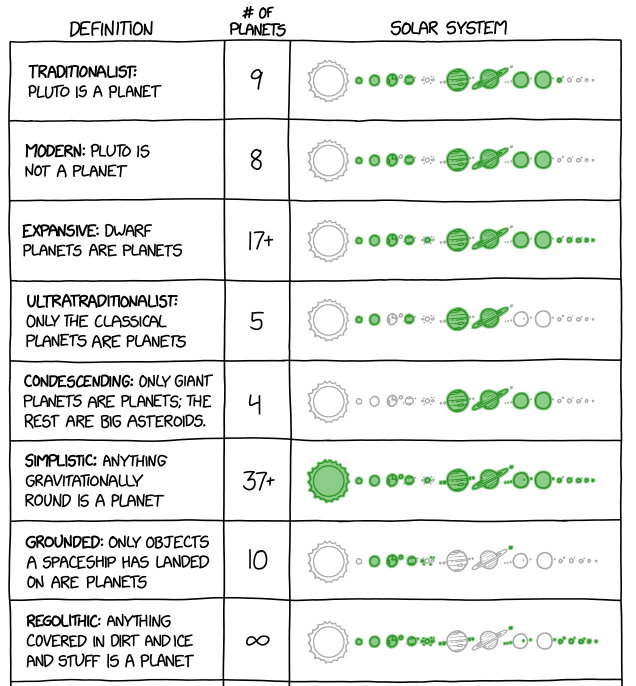
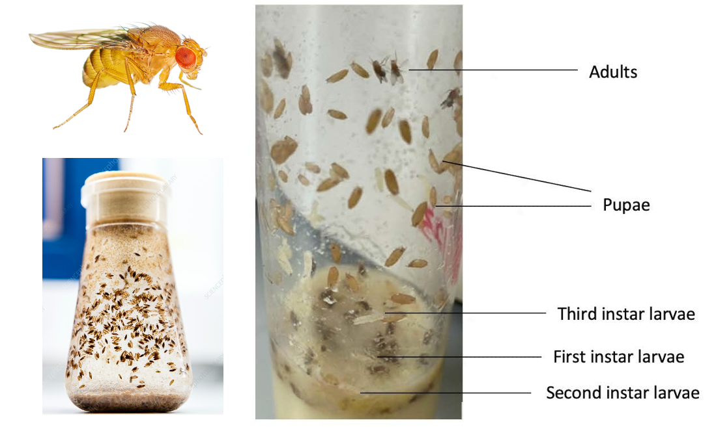

```{r setup, include=FALSE}
options(htmltools.dir.version = FALSE)
options(servr.daemon = TRUE)#para que não bloqueie a sessão
knitr::opts_chunk$set(prompt = TRUE, comment = "", eval = TRUE, echo = FALSE, warning = FALSE, message = FALSE,
                      out.width="85%")
library(xaringanthemer)
library(ggplot2)
library(ggthemes)
library(dplyr)
library(tidyr)
library(stringr)
library(latex2exp)
library(ggridges)
library(viridis)
library(knitr)
library(kableExtra)
library(janitor)
library(wesanderson)
```

```{r xaringan-themer, include=FALSE, warning=FALSE}

style_solarized_light(
  title_slide_background_color = "#586e75",# base 3
  header_color = "#586e75",
  text_bold_color = "#cb4b16",
  background_color = "#fdf6e3", # base 3
  header_font_google = google_font("DM Sans"),
  text_font_google = google_font("Roboto Condensed", "300", "300i"),
  code_font_google = google_font("Fira Mono"), text_font_size = "28px",
  code_font_size="1rem"
)
xaringanExtra::use_share_again()
xaringanExtra::use_fit_screen()
xaringanExtra::use_tachyons()
xaringanExtra::use_tile_view()

## clipboard
htmltools::tagList(
  xaringanExtra::use_clipboard(
    button_text = "Copiar código <i class=\"fa fa-clipboard\"></i>",
    success_text = "Copiado! <i class=\"fa fa-check\" style=\"color: #90BE6D\"></i>",
    error_text = "Não copiado 😕 <i class=\"fa fa-times-circle\" style=\"color: #F94144\"></i>"
  ),
  rmarkdown::html_dependency_font_awesome()
)

## ggplot theme
theme_publication <- function(base_size=14, base_family="helvetica") {
    (theme_foundation(base_size=base_size, base_family=base_family)
        + theme(plot.title = element_text(face = "bold",
                                          size = rel(1.2), hjust = 0.5),
                text = element_text(),
                panel.background = element_rect(colour = NA),
                plot.background = element_rect(colour = NA),
                panel.border = element_rect(colour = NA),
                axis.title = element_text(face = "bold",size = rel(1)),
                axis.title.y = element_text(angle=90,vjust =2),
                axis.title.x = element_text(vjust = -0.2),
                axis.text = element_text(), 
                axis.line = element_line(colour="black"),
                axis.ticks = element_line(),
                panel.grid.major = element_line(colour="#f0f0f0"),
                panel.grid.minor = element_blank(),
                legend.key = element_rect(colour = NA),
                legend.position = "bottom",
                legend.direction = "horizontal",
                legend.key.size= unit(0.2, "cm"),
                ##legend.margin = unit(0, "cm"),
                legend.spacing = unit(0.2, "cm"),
                legend.title = element_text(face="italic"),
                plot.margin=unit(c(10,5,5,5),"mm"),
                strip.background=element_rect(colour="#f0f0f0",fill="#f0f0f0"),
                strip.text = element_text(face="bold")
                ))
    
}
cor <- wes_palette("Rushmore1") #("FantasticFox1")
```

## Conceitos

+ Variáveis aleatórias

+ Funções de densidade de probabilidade

+ Distribuições de probabilidade como modelos estatísticos ($p(y \mid \theta)$)

+ A distribuição normal de probabilidade

+ Teorema central do limite

+ Método dos mínimos quadrados


---
class: inverse, middle

.col-container[
.col[
# Métodos dos mínimos quadrados - um pouco de história
]

.col[
.center[


[Joseph Stigler,1999](https://archive.org/details/historyofstatist00stig)
]
]
]

---

## O problema: combinação de observações 

.pull-left[

* A partir do séc XVII: ciência europeia acumula  medidas astronômicas e geodésicas

* Sécs XVII-XVIII: 
  * medidas repetidas nunca são iguais, mas a sua combinação reduz o erro
  * medidas sob diferentes condições também podem ser combinadas
  * diferentes maneiras de combinar (p.ex, média, minimizar erros absolutos)


]

.pull-right[
.center[

```{r, echo=FALSE, out.width="75%", fig.align="center"}

```
]

.right[

[Wikipedia: história do metro](https://en.wikipedia.org/wiki/History_of_the_metre)]

]

---

## Um exemplo: definição do metro

.pull-left[

* **1791**: Assembleia Nacional Francesa define o metro como um décimo de milionésimo da distância do equador ao polo norte

* **1792-1798**: missão Delambre & Méchain mede quatro subseções de arco ao longo do  meridiano de Paris, entre Durkink e Barcelona.

* Medidas de cada subseção necessárias para os cálculos: comprimento em unidades lineares (*Module*) e em graus, e coordenadas do ponto médio. 

]

.pull-right[
.center[

```{r, echo=FALSE, out.width="100%", fig.align="center"}
knitr::include_graphics(c("Paris_meridian_Stigler_Fig.17_1.png"))
```
]

.right[

Stigler, 1986, 1999]

]


---

## Cálculos

.pull-left[

Dados das medidas das subseções do arco:

* razão entre comprimento em *Modules* e em graus : $y = S/d$
* o quadrado do seno das coordenadas centrais : $x = \sin^2 L$

Usamos os coeficientes da aproximação linear $y = a + b x$ para calcular distância do equador ao polo norte com:

$$Q = 90 (a + b/2)$$

Problema: combinar as medidas para obter a melhor estimativa de $a$ e $b$.
]

.pull-right[
.center[

```{r, echo=FALSE, out.width="100%", fig.align="center"}
knitr::include_graphics(c("Stigler_1999_tab17_1.png"))
```
]

.right[

Stigler, 1999]

]

---

## Erros

```{r calculos-metro, echo=FALSE}
tab1 <-
    read.csv("Stigler_99_tab_17_1.csv") |>
    mutate(
        deg = as.numeric(str_extract(Midpoint, "^\\d+")),
        min = as.numeric(str_extract(Midpoint, "(?<=°|◦)\\s*\\d+")),
        sec = as.numeric(str_extract(Midpoint, "(?<=′|'|´)\\s*\\d+")),
        decimal_deg = deg + (min / 60) + (sec / 3600),
        Radians = decimal_deg * (pi / 180)) |>
    select(-deg, -min, -sec, -decimal_deg) |>
    mutate(y = Modules/Degrees, x = (sin(Radians))^2) |>
    select(X, x, y) |>
    rename(Subseção=X)
## Calcula previstos e erros com dif coeficientes
f1 <- function(a = 28227.16205, b= 541.2639353, kab=TRUE, ms=TRUE, tot=TRUE){
    y <- mutate(tab1, Previsto = a+b*x, Erro = y - Previsto)
    if(ms){
        y <- mutate(y, ms = Erro^2)
    }
    if(tot)
        y <- mutate(y, x=round(x,4), y = round(y,2), Previsto=round(Previsto,2),
                    Erro = round(Erro,2), ms=round(ms,2)) |>
            adorn_totals(where = "row", fill="", select=ms)
    if(kab){
        nomes <- names(y)
        nomes <- gsub("ms", "Erro²", nomes)
        names(y) <- nomes
        ##y <- kable(y, digits = c(1,5,2,2,2,2), caption=paste0("a = ",round(a,1)," , b = ", round(b,1)))
        y <- kable(y, digits = c(1,5,2,2,2,2))
    }
    return(y)
    }
tab1a <- f1(kab=FALSE, ms=FALSE, tot = FALSE)
a <- 28227.16205
b <- 541.2639353
a2 <- a + tab1a[1,5]
b2 <- (tab1a[2,3]-a)/tab1a[2,2]
```
.center[### a = `r format(round(a2, 2), scientific = FALSE)` , b = `r round(b,2)`

```{r echo=FALSE}
f1(a2, b, ms=FALSE, tot = FALSE)
```
]

---

## Erros

.center[### a = `r format(round(a, 2), scientific = FALSE)` , b = `r round(b2,2)`

```{r echo=FALSE}
f1(a, b2, ms=FALSE, tot = FALSE)
```
]


---

## Soma dos quadrados dos erros

.center[### a = `r format(round(a, 2), scientific = FALSE)` , b = `r round(b2,2)`

```{r echo=FALSE}
f1(a, b2)
```
]


---

## Soma dos quadrados dos erros

.center[### a = `r format(round(a, 2), scientific = FALSE)` , b = `r round(b,2)`

```{r echo=FALSE}
f1(a, b)
```
]

---

## Método dos mínimos quadrados (1805)

.pull-left[
.center[

```{r, echo=FALSE, out.width="50%", fig.align="center"}

```

Adrien-Marie Legendre (1752-1883), <br>  único retrato conhecido, [Wikipedia](https://en.wikipedia.org/wiki/Adrien-Marie_Legendre)
]

]

.pull-right[
.center[
```{r out.width="85%", fig.align="center"}

y1 <- tab1$y
x1 <- tab1$x
lm1 <- lm(y1 ~ x1)
prev <- predict(lm1)
par(bg = NA)
plot(y1 ~ x1, bty = "l", cex = 1.5, col = cor[3],
     #xaxt="n", yaxt="n",
     xlab = "x", ylab = "y",
     pch = 19, cex.axis = 1.5, cex.lab = 1.5, ylim = c(28450, 28550))
segments(x0 = x1, x1 = x1, y0 = y1, y1 = prev, lty = 2, lwd = 2)
abline(lm1, lwd = 3, col = cor[2], cex = 2)

```
]
]


---

## ... que levou à distribuição Normal (1809)

.pull-left[
.center[

```{r, echo=FALSE, out.width="50%", fig.align="center"}

```

Carl Friedrich Gauss (1777-1855), <br> [Wikipedia](https://en.wikipedia.org/wiki/Carl_Friedrich_Gauss)
]

]

.pull-right[
.center[
```{r, echo=FALSE, out.width="75%", fig.align="center"}

```
]
]

---

## ... que levou ao teorema do limite central (1812)

.pull-left[
.center[

```{r, echo=FALSE, out.width="50%", fig.align="center"}

```

Pierre Simon Laplace (1749-1827) ([Wikipedia](https://en.wikipedia.org/wiki/Pierre-Simon_Laplace))
]

]

.pull-right[
<iframe 
  src="https://commons.wikimedia.org/wiki/File:Galton_box.webm?embedplayer=true" 
  width="100%" 
  height="450" 
  frameborder="0" 
  allowfullscreen>
</iframe>
Tabuleiro de Galton (1873) ([Wikipedia](https://pt.wikipedia.org/wiki/Tabuleiro_de_Galton)) 
]

---

## Somos todos ogros

.pull-left[

1. Se você não está entendendo tudo, é porque está prestando atenção.

2. "Síndrome do impostor" muitas vezes é reconhecimento da complexidade de um tema, o que não é pouco.

3. O aprendizado é gradual: cada etapa de entendimento é valiosa em si e porque é necessária para as seguintes.
]


.pull-right[
.center[
```{r, echo=FALSE, out.width="75%", fig.align="center"}

```
]
]

---
class: inverse, middle

.col-container[
.col[
# Conceitos e definições
]

.col[
.center[


["Planet definitions", xkcd](https://xkcd.com/3063/)
]
]
]

---
## Um conjunto de dados experimentais


.pull-left[

* Coleta de populações de *Drosophila melanogaster* em 18 locais na Austrália.
* Linhagens isofêmeas: progênie separadas de cada fêmea coletada,
  obtida de 10 gerações em laboratório.
* 50 larvas das linhagens de cada população mantidas a
  18°C, 25°C e 29°C durante o desenvolvimento (3 réplicas por tratamento).
* Condições controladas de laboratório: frascos, meio de cultura, fotoperíodo,
  temperatura, densidade de moscas, etc.
* Medição das moscas adultas nascidas sob cada tratamento.

]

.pull-right[
.center[


]

.right[

Van Heerwaarden & Sgrò, *Evolution* (2011).]

]

---

## Um conjunto de dados experimentais


```{r drosophila thorax length data}

dthor <- read.csv("42_Van_Heerwaarden_&_Sgro_2011_Dmelanogaster_thorax_length.csv")
## Sample means
dthor.m <-
    dthor %>%
    filter(Sex == "female", Temperature == "25") %>%
    group_by(Population) %>%
    summarise(th.mean = mean(Thorax_length, na.rm=TRUE)) %>%
    arrange(th.mean) %>%
    as.data.frame()
```

.pull-left[

* 30 adultos sorteados entre as moscas criadas em
  cada temperatura.
* Os histogramas mostram as frequências de moscas em classes de comprimento do tórax
para cada população, apenas para fêmeas criadas a 25°C.
* As linhas azuis são as médias do comprimento do tórax de cada amostra.
]


.pull-right[
.center[

```{r drosophila pops histogram}
p.dros <-
    dthor %>%
    filter(Sex == "female", Temperature == "25") %>%
    mutate(pop = factor(Population, levels = dthor.m$Population)) %>%
    ggplot(aes(x = Thorax_length)) +
    geom_histogram(bins = 8, alpha =0.3) +
    geom_vline(data = dthor.m, aes(xintercept = th.mean), color = "blue", size = 1.5) +
    xlab("Comprimento do tórax (mm)") +
    ##geom_density() +
    facet_wrap(~ Population) +
    theme_publication(18)
p.dros
    
```
]
]

---

## Distribuição das médias amostrais

.pull-left[
.center[

```{r }

p.dros
    
```
]
]

.pull-right[
.center[


```{r drosophila-mean-hist}

p.dros2 <-
    dthor.m %>%
    ggplot(aes(th.mean)) +
    geom_histogram(binwidth = 0.013, alpha =0.5) +
    geom_rug(col = "blue", size =1.1) +
    xlim(0.97, 1.1) +
    xlab("Comprimento médio do tórax (mm)")+
    ylab("Contagem (nº de populações)") +
    ggtitle("Distribuição das médias populacionais") +
    theme_publication(18)

p.dros2
```

]]


---


## Variáveis aleatórias

.pull-left[

* Muitos valores são possíveis, mesmo para médias de medidas tomadas
  exatamente da mesma forma e sob condições fortemente controladas.

* Medidas científicas são **variáveis aleatórias**: quantidades que
  são inevitavelmente afetadas por eventos aleatórios.

* Como lidar com isso? Com modelos que nos dizem qual é a chance de
observar cada valor possível da medida.

* Em outras palavras, construindo **distribuições de probabilidade**.

]

.pull-right[
.center[


```{r }
p.dros2
```

]]

---

## 1º passo: a escala de densidade

.pull-left[


* Vamos reescalonar o eixo y deste histograma para que a área total
  do histograma seja igual a um.
* Ou seja, expressamos as frequências (ou contagens) originais em uma nova
  escala, de modo que a soma das áreas das barras seja igual a um. Chamamos
  essa escala de **densidade**.
* Este é um reescalonamento linear (ou seja, proporcional), então a forma do
  histograma não muda.

]

.pull-right[
.center[


```{r}
p1 <-
    dthor.m %>%
    ggplot(aes(th.mean)) +
    geom_histogram(aes(y=after_stat(density)), binwidth = 0.013, alpha =0.5) +
    xlim(0.97, 1.1) +
    xlab("Comprimento médio do tórax (mm)")+
    ylab("Densidade") +
    ggtitle("Distribuição das médias populacionais") +
    theme_publication(18)

p1 + geom_rug(col = "blue", size =1.1)

```

]]

---

## 2º passo: a função de densidade

.pull-left[

* Agora vamos imaginar como "suavizar" a distribuição de densidades,
  usando uma função contínua.
* Pense nessa função como a representação contínua (ou um limite
  contínuo) do histograma. Essa é a **função de densidade**.
* A área sob a curva de uma função de densidade é igual a um.

]


.pull-right[
.center[


```{r}

p1  + geom_density(color = "blue", size = 1.5)

```

]]


---


## Função de densidade: algumas definições

.pull-left[

* A função de densidade é uma função matemática contínua $f(x)$ que retorna um valor de
  densidade para qualquer valor da medida $x$.
* Chamamos de **espaço amostral** ( $\Omega$ ) o conjunto de todos os valores que uma
  variável aleatória pode assumir.


]


.pull-right[
.center[


```{r}
dmd <- density(dthor.m$th.mean)
tmp <- data.frame(x = dmd$x, y = dmd$y)
index <- min(which(tmp$x > 1.015, arr.ind = TRUE))
p2 <-
    dthor.m %>%
    ggplot(aes(th.mean)) +
    geom_density(color = "blue", size = 1.5) +
    xlim(0.97, 1.1) +
    xlab("Comprimento médio do tórax (mm)")+
    ylab("Densidade") +
    ##ggtitle("Distribuição das médias populacionais") +
    theme_publication(18)

p2  +
    geom_segment(aes(x = x , xend = x, y = 0, yend =y),
                 data = tmp[index,], col = "red",
                 linetype = "dashed", size = 1.1) +
    geom_segment(aes(x = x, xend = 0.97, y = y, yend =y),
                 data = tmp[index,], col = "red",
                 linetype = "dashed", size = 1.1)

    
```

]]


---

## Função de densidade e probabilidades

.pull-left[


* A integral de $f(x)$ sobre o espaço amostral é igual a um.

* Essa é uma forma matemática de dizer que a área sob $f(x)$ é igual a um.

]

.pull-right[
.center[
```{r}
p2 +
    geom_ribbon(aes(x=x, ymin=0, ymax =y),
                data = tmp,
                fill = "blue", alpha =.5) +
    geom_segment(aes(x=1.05, xend=1.065, y= 13, yend = 15), arrow = arrow()) +
    annotate("label", x = 1.087, y = 15, label = TeX(r"($\int_{\Omega} f(x) \, dx = 1$)", output = "character"),
             parse = TRUE, size = 7)

```
]]

---

## Função de densidade e probabilidades

.pull-left[


* A área sob $f(x)$ para qualquer intervalo $L \leq x \leq U$ é uma
  fração da área total sob $f(x)$.

* Essa área é uma expressão matemática da **probabilidade atribuída
  a um intervalo de medidas**. Ela também é uma integral definida da função
  de densidade:

$$ P(L \leq x \leq U) ~ = ~ \int_L^U f(x) \, dx $$

]

.pull-right[
.center[
```{r}
p2 +
    geom_ribbon(aes(x=x, ymin=0, ymax =y),
                data = filter(tmp, x>1.04&x<1.08),
                fill = "blue", alpha =.5) +
    geom_segment(aes(x=1.05, xend=1.067, y= 13, yend = 15), arrow = arrow()) +
    annotate("label", x = 1.087, y = 15, label = TeX(r"($\int_{1.04}^{1.08} f(x) \, dx)", output = "character"),
             parse = TRUE, size = 7)

```
]]

---


## Distribuições de probabilidade como modelos


* A função de densidade que definimos é usada para expressar
  probabilidades de variáveis aleatórias, ou seja, uma **distribuição
  de probabilidade**.

--

* É um modelo que atribui probabilidades aos dados, isto é, aos
  valores de uma variável aleatória.

--

* No nosso exemplo, a variável aleatória é o comprimento médio do tórax que
  obtivemos a partir de amostras de 30 moscas.

--

* Com esse tipo de modelo, podemos fazer muitas perguntas interessantes sobre
  essas médias amostrais, como:


---

class: center, middle

### Qual é a probabilidade de um comprimento médio do tórax de até 1,04 mm?

```{r, out.width="40%"}
p2 +
    geom_ribbon(aes(x=x, ymin=0, ymax =y),
                data = filter(tmp, x>0.96&x<1.04),
                fill = "blue", alpha =.5)
```

---

class: center, middle

### Qual é o intervalo de confiança para o comprimento médio do tórax?

```{r, out.width="40%"}
p2 +
    geom_ribbon(aes(x=x, ymin=0, ymax =y),
                data = filter(tmp, x>0.995&x<1.07),
                fill = "blue", alpha =.5) +
    geom_vline(xintercept = 0.995, col = "red", linetype = "dashed", size = 1.1) +
    geom_vline(xintercept = 1.07, col = "red", linetype = "dashed", size = 1.1) +
    geom_segment(aes(x=0.995, xend = 1.07, y = 26.5, yend = 26.5),
                 arrow = arrow(ends = "both"),
                 col = "red") +
    annotate("label", x = 1.035, y = 26.5, label = "IC 95%", size = 7) 
```


---


## Qual distribuição de probabilidade?


* Agora sabemos que distribuições de probabilidade são uma boa escolha para
  modelar variáveis aleatórias. Mas como construir um modelo desses?

--

* Há receitas para isso, mas muitas distribuições de probabilidade
  já foram propostas, para uma enorme variedade de tipos de dados.

--

* No nosso exemplo, nossa variável aleatória são médias amostrais. O **Teorema
  Central do Limite** afirma que as médias amostrais seguem uma distribuição
  Normal à medida que o tamanho das amostras aumenta.
  
--

* Esse é um dos resultados mais importantes da teoria da probabilidade. Temos
  ótimas razões para escolher a distribuição Normal como nosso
  modelo estatístico.

---

## A distribuição Normal

.pull-left[

* Criada para descrever a distribuição de erros de medida aditivos.
* O TCL nos diz que este é um bom modelo para qualquer variável aleatória que seja
a soma de muitas outras variáveis aleatórias (como médias amostrais).
* É uma distribuição simétrica, sempre em forma de sino.
* Tem dois parâmetros, que correspondem à média e ao desvio-padrão
  da distribuição.
* Sua média e seu desvio-padrão são independentes.
]

.pull-right[
.center[

```{r normal-curve}

ggplot(data.frame(x = c(-4, 4)), aes(x = x)) +
    stat_function(fun = dnorm, col = "blue", size = 1.5) +
    annotate("label", x = 2.6, y = 0.35,
             label = TeX(r"($f(x) \, = \, \frac{1}{\sigma \sqrt{2\pi}} \; e^{- \frac{1}{2} \left( \frac{x-\,\mu}{\sigma} \right)^2} $)",
                         output = "character"),
             parse = TRUE, size = 6) +
    xlab("x") +
    ylab("Densidade") +
    ggtitle("Função de densidade de probabilidade Normal") +
    theme_publication(18)
```

]]

---


## Parâmetro de posição da distribuição Normal


.pull-left[

* A Normal tem um **parâmetro de posição**, que chamaremos de $\mu$.
* Esse parâmetro corresponde à média da distribuição Normal.
* Ao mudar $\mu$, mudamos a posição da distribuição Normal
ao longo do eixo x, sem alterar o desvio-padrão.
]

.pull-right[
.center[
	```{r normal-location}
    
    df1 <- data.frame(
        case_number = factor(1:5),
        caseMean = c(-4, -2, 0, 2, 4),
        caseSD = 1
    )
    
    n <- 100
    df3 <-
        df1 %>%
        mutate(low  = caseMean - 3 * caseSD, high = caseMean + 3 * caseSD) %>%
        uncount(n, .id = "row") %>%
        dplyr::mutate(x    = (1 - row/n) * low + row/n * high, 
                      norm = dnorm(x, caseMean, caseSD))
    
    ggplot(df3, aes(x, factor(case_number), height = norm, color = case_number)) +
        geom_ridgeline(scale = 3, aes(fill = case_number), alpha =0.5, linetype = 0) +
        xlim(-9,7) + 
        theme_publication(18) +
        theme(legend.position = "none",
              axis.line.y = element_blank(),
              axis.text.y = element_blank(),
              axis.ticks.y = element_blank(),
              axis.title.y = element_blank()
              ) +
        annotate("text", x = rep(-8.5,5),
                 y = 1:5 + 0.05,
                 label = c(TeX(r"($\mu = - 4$)"), TeX(r"($\mu = - 2$)"), TeX(r"($\mu = 0$)"),
                           TeX(r"($\mu = 2$)"), TeX(r"($\mu = 4$)")),
                 size = 6)
	```
]
]

---

## Parâmetro de escala da distribuição Normal

.pull-left[

* A Normal tem um **parâmetro de escala**, que chamaremos de $\sigma$.
* Esse parâmetro corresponde ao desvio-padrão da distribuição Normal.
* Ao mudar $\sigma$, mudamos a dispersão da distribuição Normal
em torno da média, sem alterar a média.
]


.pull-right[
.center[

```{r normal-scale}

df1 <- data.frame(
    case_number = factor(1:5),
    caseMean = 0,
    caseSD = rev(seq(0.5, 2.5,  by =0.5))
    )

n <- 100
df3 <-
    df1 %>%
    mutate(low  = caseMean - 3 * caseSD, high = caseMean + 3 * caseSD) %>%
    uncount(n, .id = "row") %>%
    dplyr::mutate(x    = (1 - row/n) * low + row/n * high, 
           norm = dnorm(x, caseMean, caseSD))

ggplot(df3, aes(x, factor(case_number), height = norm, color = case_number)) +
    geom_ridgeline(scale = 3, aes(fill = case_number), alpha =0.5, linetype = 0) +
    xlim(-9,7) + 
    theme_publication(18) +
    theme(legend.position = "none",
          axis.line.y = element_blank(),
          axis.text.y = element_blank(),
          axis.ticks.y = element_blank(),
          axis.title.y = element_blank()
          ) +
    annotate("text", x = rep(-8.5,5),
             y = 1:5 + 0.05,
             label = c(TeX(r"($\sigma = 2.5$)"), TeX(r"($\sigma = 2$)"), TeX(r"($\sigma = 1.5$)"),
                       TeX(r"($\sigma = 1$)"), TeX(r"($\sigma = 0.5$)")),
             size = 6)
```
]]

---

## O modelo de regressão linear

.pull-left[

* Agora vamos examinar a distribuição das médias nas três temperaturas

* Para cada temperatura, temos 18 médias, das medidas de 30 indivíduos de cada população de origem

* Queremos um modelo que combine essas medidas repetidas para cada tratamento para estimar o melhor possível qual o tamanho médio sob cada temperatura.
]

.pull-right[
```{r empirical-means-by-temperature}
## Médias do comprimento do tórax das fêmeas, por população e temperatura
dthor.mt <-
    dthor |>
    filter(Sex == "female") |>
    group_by(Temperature, Population) |>
    summarise(th.mean = mean(Thorax_length, na.rm = TRUE), .groups = "drop") |>
    mutate(temp = factor(Temperature, levels = c(18, 25, 29)))
## Histogramas calculados manualmente (em escala de densidade)
bw <- 0.012     # largura das classes
origem <- 0.95  # ponto de partida das classes
hist.mt <-
    dthor.mt |>
    mutate(i = floor((th.mean - origem) / bw)) |>
    count(temp, i) |>
    reframe(bin = (min(i) - 1):(max(i) + 1),          # classes vazias nas pontas
            n = coalesce(n[match(bin, i)], 0L),
            .by = temp) |>
    mutate(dens = n / (sum(n) * bw), .by = temp)
## Contorno em "escada": borda esquerda e direita de cada classe
passos.mt <-
    bind_rows(
        mutate(hist.mt, x = origem + bin * bw,       ordem = 1),
        mutate(hist.mt, x = origem + (bin + 1) * bw, ordem = 2)
    ) |>
    arrange(temp, bin, ordem) |>
    rename(height = dens)
## Altura máxima dos histogramas, em graus Celsius no eixo da temperatura
largura.max <- 3
esc.hist <- largura.max / max(passos.mt$height)

ggplot(passos.mt, aes(x = x, y = as.numeric(as.character(temp)),
                      height = height, fill = temp, color = temp)) +
    geom_ridgeline(scale = esc.hist, alpha = 0.5) +
    scale_y_continuous(breaks = c(18, 25, 29)) +
    xlab("Comprimento médio do tórax (mm)") +
    ylab("Temperatura (°C)") +
    coord_flip(xlim = c(0.92, 1.14), ylim = c(17, 33)) +
    theme_publication(18) +
    theme(legend.position = "none")
```
]

---

## O modelo de regressão linear

.pull-left[

* Temos boas razões para assumir que 
  o comprimento médio do tórax em cada tratamento tende a uma distribuição normal.

* Vamos começar com um modelo simples: o comprimento médio do tórax das populações é uma
  função linear da temperatura: $\mu = a + b X$

* O que buscamos, então, são valores de $a$ e $b$ que resultem na
  previsão com menor erro possível do comprimento do tórax para cada
  temperatura.


]

.pull-right[
```{r empirical-means-normal-fit}
## Histogramas calculados manualmente (em escala de densidade)
bw <- 0.012     # largura das classes
origem <- 0.95  # equivalente ao boundary

hist.mt <-
    dthor.mt |>
    mutate(i = floor((th.mean - origem) / bw)) |>
    count(temp, i) |>
    reframe(bin = (min(i) - 1):(max(i) + 1),          # classes vazias nas pontas
            n = coalesce(n[match(bin, i)], 0L),
            .by = temp) |>
    mutate(dens = n / (sum(n) * bw), .by = temp)

## Contorno em "escada": borda esquerda e direita de cada classe
passos.mt <-
    bind_rows(
        mutate(hist.mt, x = origem + bin * bw,       ordem = 1),
        mutate(hist.mt, x = origem + (bin + 1) * bw, ordem = 2)
    ) |>
    arrange(temp, bin, ordem) |>
    rename(height = dens)

## Curvas normais: média de cada temperatura, desvio-padrão médio
param.mt <-
    dthor.mt |>
    summarise(media = mean(th.mean), dp = sd(th.mean), .by = temp)
dp.medio <- mean(param.mt$dp)

curvas.mt <-
    param.mt |>
    reframe(x = seq(media - 3 * dp.medio, media + 3 * dp.medio, length.out = 200),
            height = dnorm(x, media, dp.medio),
            .by = temp)

## Mesmo fator de escala para histogramas e curvas
esc <- 0.5 / max(c(passos.mt$height, curvas.mt$height))
## Altura máxima de cada histograma, em graus Celsius no eixo da temperatura
largura.max <- 3
esc <- largura.max / max(c(passos.mt$height, curvas.mt$height))

ggplot(mapping = aes(x = x, y = as.numeric(as.character(temp)), height = height)) +
    geom_ridgeline(data = passos.mt, aes(fill = temp, color = temp),
                   scale = esc, alpha = 0.5) +
    geom_ridgeline(data = curvas.mt, aes(color = temp),
                   fill = NA, scale = esc, linewidth = 1.2) +
    scale_y_continuous(breaks = c(18, 25, 29)) +
    xlab("Comprimento médio do tórax (mm)") +
    ylab("Temperatura (°C)") +
    coord_flip(xlim = c(0.92, 1.14), ylim = c(17, 33)) +
    theme_publication(18) +
    theme(legend.position = "none")
```
]

---

## Ajuste do modelo

.pull-left[

* Assim, podemo usar o método dos mínimos quadrados para combinar
  todas as medidas que temos e encontrar os valores de $a$ e $b$ que
  minimizam o erro de previsão.

* Ajustar um modelo estatístico nada mais é que encontrar valores de
  seus parâmetros adequados para descrever os dados.

* No método de mínimos quadrados, esta adequabilidade é expressa pela
  soma dos quadrados dos resíduos.

]

.pull-right[
```{r empirical-means-regression}
## Regressão linear das médias populacionais em função da temperatura
mod.mt <- lm(th.mean ~ Temperature, data = dthor.mt)

reta.mt <- data.frame(Temperature = seq(18, 32, length.out = 100))
reta.mt$pred <- predict(mod.mt, newdata = reta.mt)

ggplot(mapping = aes(x = x, y = as.numeric(as.character(temp)), height = height)) +
    geom_ridgeline(data = passos.mt, aes(fill = temp, color = temp),
                   scale = esc, alpha = 0.5) +
    geom_ridgeline(data = curvas.mt, aes(color = temp),
                   fill = NA, scale = esc, linewidth = 1.2) +
    geom_line(data = reta.mt, aes(x = pred, y = Temperature),
              inherit.aes = FALSE, linewidth = 1.2) +
    scale_y_continuous(breaks = c(18, 25, 29)) +
    xlab("Comprimento médio do tórax (mm)") +
    ylab("Temperatura (°C)") +
    coord_flip(xlim = c(0.92, 1.14), ylim = c(17, 33)) +
    theme_publication(18) +
    theme(legend.position = "none")
```
]

---

## Ajuste do modelo

.pull-left[

* Assim, podemo usar o método dos mínimos quadrados para combinar
  todas as medidas que temos e encontrar os valores de $a$ e $b$ que
  minimizam o erro de previsão.

* Ajustar um modelo estatístico nada mais é que encontrar valores de
  seus parâmetros adequados para descrever os dados.

* No método de mínimos quadrados, esta adequabilidade é expressa pela
  soma dos quadrados dos resíduos.

]

.pull-right[

```{r empirical-means-scatter}
## Regressão linear das médias populacionais em função da temperatura
mod.mt <- lm(th.mean ~ Temperature, data = dthor.mt)

## Previsões ao longo de todo o eixo, marcando o trecho com dados
reta.mt <- data.frame(Temperature = seq(17, 33, length.out = 200))
reta.mt$pred <- predict(mod.mt, newdata = reta.mt)
reta.mt$trecho <- ifelse(reta.mt$Temperature < 18, "abaixo",
                  ifelse(reta.mt$Temperature > 29, "acima", "dados"))

ggplot(mapping = aes(x = x, y = as.numeric(as.character(temp)), height = height)) +
    ## Curvas normais
    geom_ridgeline(data = curvas.mt, aes(color = temp, fill = temp),
                   scale = esc, alpha = 0.15, linewidth = 1.2) +
    ## Médias populacionais, com jitter na temperatura
    geom_point(data = dthor.mt,
               aes(x = th.mean, y = Temperature, color = temp),
               inherit.aes = FALSE, size = 3, alpha = 0.7,
               position = position_jitter(width = 0, height = 0.4, seed = 42)) +
    ## Reta de regressão (tracejada fora da faixa dos dados)
    geom_line(data = reta.mt,
              aes(x = pred, y = Temperature, group = trecho,
                  linetype = trecho == "dados"),
              inherit.aes = FALSE, linewidth = 1.2) +
    scale_linetype_manual(values = c("TRUE" = "solid", "FALSE" = "dashed")) +
    scale_y_continuous(breaks = c(18, 25, 29)) +
    xlab("Comprimento médio do tórax (mm)") +
    ylab("Temperatura (°C)") +
    coord_flip(xlim = c(0.92, 1.14), ylim = c(17, 33)) +
    theme_publication(18) +
    theme(legend.position = "none")
```

]

---

## Ajuste no R

.pull-left[

```{r ajuste-lm, echo = TRUE, eval = FALSE}
m1 <- lm(th.mean ~ Temperature, 
         data = dthor.mt)
plot(th.mean ~ Temperature, 
     data = dthor.mt,
     xlab = "Temperatura",
     ylab = "Comprimento tórax (mm)")
abline(m1, col = "blue")
```


]

.pull-right[

```{r grafico-lm, eval=TRUE, echo=FALSE, ref.label="ajuste-lm"}

```

]

---

## Um pouco de notação


* Nosso modelo: o comprimento médio do tórax $y$ segue uma distribuição normal:

$$ y \, \sim \, \text{Normal}(\mu, \sigma)$$

--

* Sendo que a média desta distribuição é uma função linear da temperatura $x$

$$ \mu = a + b x$$


--

* E o desvio-padrão desta distribuição é constante 

---

## Um pouco de notação

* A notação $y \sim \text{Normal}(\mu, \sigma)$ nos lembra que nosso modelo é uma distribuição de probabilidades.

--

* Desta maneira, nosso modelo atribui probabilidades a cada valor de $y$

--

* Isto vale para qualquer modelo estatístico. Todos eles utilizam alguma distribuição de probabilidades para atribuir probabilidades a observações.

--

* Podemos expressar isto como $p(y_i \mid \theta)$ (a probabilidade
  $p$ que o modelo atribui a cada observação $y_i$, considerando os
  valores de seus parâmetros $\theta$.

---

## Um pouco de notação

Como na distribuição normal a média é independente do desvio padrão, uma notação alternativa do nosso modelo é a seguinte:

* O comprimento do tórax é uma função linear da temperatura, mais um erro de distribuição normal com média zero e desvio-padrão constante:

$$\begin{eqnarray*}
        y & = & a + b x \ + \ \epsilon,   \\ \\
        \epsilon & \sim & \text{Normal}(\mu = 0, \ \sigma)   
      \end{eqnarray*}$$

---


## Mensagens para levar para casa

1. Distribuições de probabilidade atribuem
   probabilidades a cada valor possível de uma medida.

--

2. Assim, distribuições de probabilidade podem ser concebidas como modelos do
   processo que gera os dados em questão.

--

3. Ajustamos um modelo estatístico encontrando valores razoáveis para os
   parâmetros das distribuições de probabilidade.

--

4. O método dos mínimos quadrados é uma maneira de encontrar estes valores razoáveis, se supomos que as observações têm uma distribuição normal

--
5. Esta premissa de normalidade é razoável quando as observações resultam de soma de muitas variáveis aleatórias.

---

## Referências

+ Bolker, B.M. 2008 Ecological Models and Data in R. Princeton:
    Princeton University Press.

+ Gotelli, N.J., Ellison, A.M., Ellison, S.E., 2004. A Primer of
  Ecological Statistics. Sinauer Associates Publishers.

+ McElreath, R., 2018. Statistical Rethinking: A Bayesian Course with
  Examples in R and Stan, 2nd ed. CRC Press.


