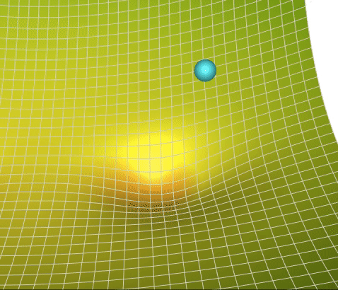
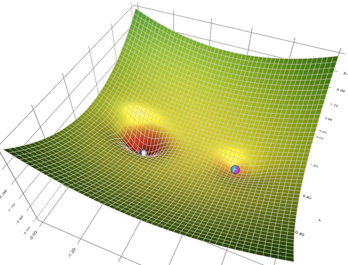
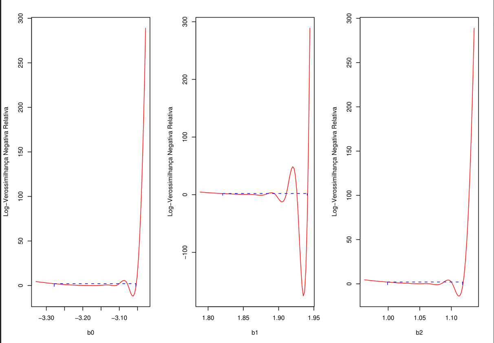

```{r setup, include=FALSE, warning=FALSE}
options(htmltools.dir.version = FALSE)
options(servr.daemon = TRUE)#para que não bloqueie a sessão
knitr::opts_chunk$set(prompt = TRUE, comment = "", eval = TRUE, echo = FALSE, warning = FALSE, message = FALSE,
                      out.width="85%")
library(xaringanthemer)
library(ggplot2)
library(ggthemes)
library(dplyr)
library(tidyr)
library(stringr)
library(latex2exp)
library(ggridges)
library(viridis)
library(knitr)
library(kableExtra)
library(janitor)
library(sads)
library(plotly)
```

```{r xaringan-themer, include=FALSE}
style_solarized_light(
  title_slide_background_color = "#586e75",# base 3
  header_color = "#586e75",
  text_bold_color = "#cb4b16",
  background_color = "#fdf6e3", # base 3
  header_font_google = google_font("DM Sans"),
  text_font_google = google_font("Roboto Condensed", "300", "300i"),
  code_font_google = google_font("Fira Mono"), text_font_size = "24px",
  code_font_size="1rem",
  extra_css = list(
      ".pull-left > :first-child, .pull-right > :first-child" = list("margin-top" = "0")
  )
)
xaringanExtra::use_share_again()
xaringanExtra::use_fit_screen()
xaringanExtra::use_tachyons()
xaringanExtra::use_tile_view()

## clipboard
htmltools::tagList(
  xaringanExtra::use_clipboard(
    button_text = "Copiar código <i class=\"fa fa-clipboard\"></i>",
    success_text = "Copiado! <i class=\"fa fa-check\" style=\"color: #90BE6D\"></i>",
    error_text = "Não copiado 😕 <i class=\"fa fa-times-circle\" style=\"color: #F94144\"></i>"
  ),
  rmarkdown::html_dependency_font_awesome()
)
## ggplot theme
theme_Publication <- function(base_size=14, base_family="helvetica") {
    (theme_foundation(base_size=base_size, base_family=base_family)
        + theme(plot.title = element_text(face = "bold",
                                          size = rel(1.2), hjust = 0.5),
                text = element_text(),
                panel.background = element_rect(colour = NA),
                plot.background = element_rect(colour = NA),
                panel.border = element_rect(colour = NA),
                axis.title = element_text(face = "bold",size = rel(1)),
                axis.title.y = element_text(angle=90,vjust =2),
                axis.title.x = element_text(vjust = -0.2),
                axis.text = element_text(), 
                axis.line = element_line(colour="black"),
                axis.ticks = element_line(),
                panel.grid.major = element_line(colour="#f0f0f0"),
                panel.grid.minor = element_blank(),
                legend.key = element_rect(colour = NA),
                legend.position = "bottom",
                legend.direction = "horizontal",
                legend.key.size= unit(0.2, "cm"),
                ##legend.margin = unit(0, "cm"),
                legend.spacing = unit(0.2, "cm"),
                legend.title = element_text(face="italic"),
                plot.margin=unit(c(10,5,5,5),"mm"),
                strip.background=element_rect(colour="#f0f0f0",fill="#f0f0f0"),
                strip.text = element_text(face="bold")
                ))
    
}
## Aux functions
f.rib <- function(X, dpad = 5)
    geom_ribbon(aes(ymin= y - X*dpad, ymax = y + X*dpad), fill = "blue", alpha = 0.01)

make.q <- function(from, to, cfs, normal=TRUE, sig, size=100){
    if(normal)
        df <- data.frame(x = seq(from, to, length =size)) %>%
            mutate(y = cfs[1]+cfs[2]*x,
                   low.1 =  qnorm(0.05, size, mean = y, sd =sig),
                   upp.1 =  qnorm(0.95, size, mean = y, sd =sig),
                   low.2 =  qnorm(0.25, size, mean = y, sd =sig),
                   upp.2 =  qnorm(0.75, size, mean = y, sd =sig))
    else
        df <- data.frame(x = seq(from, to, length =size)) %>%
            mutate(y = cfs[1]+cfs[2]*x,
                   low.1 =  qpois(0.05, size, lambda = y),
                   upp.1 =  qpois(0.95, size, lambda = y),
                   low.2 =  qpois(0.25, size, lambda = y),
                   upp.2 =  qpois(0.75, size, lambda = y))
} 

plot.q <- function(df2, df1){
    ggplot(df2, aes(x, y)) +
        geom_line(col="navy") +
        geom_ribbon(aes(ymin = low.1, ymax = upp.1), fill="blue", alpha =0.25) +
        geom_ribbon(aes(ymin = low.2, ymax = upp.2), fill="blue", alpha =0.25) +
        geom_point(data = df1, color ="red", size=1.25, stroke=1.25)  +
        theme_Publication(18)
    }
```

## Recapitulando

* Modelos estatísticos descrevem a distribuição de probabilidades de
  variáveis aleatórias.

--

* No modelo de regressão linear simples, uma resposta $Y$ é descrita
  como uma variável aleatória Gaussiana, com um parâmetro de posição $\mu$ que é uma
  função linear de uma variável $X$:
  
$$
\begin{align}
y_i &\sim \mathcal{N}(\mu_i, \sigma) \\
\mu_i & = \beta_{0} + \beta_1 x_i
\end{align}
$$

--

* O método dos mínimos quadrados (MQ, ou *OLS*) é uma forma de ajustar o modelo de
  regressão linear, minimizando a soma dos quadrados dos resíduos.


---

## Hoje veremos ...

* que a soma dos quadrados dos erros é proporcional à probabilidade
  que o modelo de regressão simples atribui aos dados ($p(y \mid \theta)$).

--


* que MQ é uma ótima ideia para ajustar modelos Gaussianos, pois é um
caso particular do **Método da Máxima Verossimilhança** (MV, ou *ML*)

--

* que a MV fornece um critério geral para encontrar os valores dos parâmetros que
  são mais apoiados pelos dados, para qualquer modelo estatístico.

--

* como as estimativas de MV (*MLE*) podem ser calculadas (ou como podemos ajustar modelos
  aos dados pelo método de MV, o que é a mesma coisa).

---

## Nossa velha amiga, a regressão linear

.pull-left[
$$\begin{align}
y_i &\sim \mathcal{N}(\mu_i, \sigma) \\
\mu_i & = \beta_0 + \beta_1 x_i \\
\sigma & = C
\end{align}$$

de forma mais compacta:

$$y_i \sim \mathcal{N}(\mu_i = \beta_0 + \beta_1 x_i, ~ \sigma)$$

O que implica que:

$$p(y_i \mid \theta) = \mathcal{N}(y_i | \mu_i = \beta_0 + \beta_1 x_i, ~ \sigma)$$

onde: 
$$\theta = \{\beta_0, \beta_1, \sigma\}$$ 

]


.pull-right[
.center[
```{r }

df1 <-
    read.csv("Stigler_99_tab_17_1.csv") |>
    mutate(
        deg = as.numeric(str_extract(Midpoint, "^\\d+")),
        min = as.numeric(str_extract(Midpoint, "(?<=°|◦)\\s*\\d+")),
        sec = as.numeric(str_extract(Midpoint, "(?<=′|'|´)\\s*\\d+")),
        decimal_deg = deg + (min / 60) + (sec / 3600),
        Radians = decimal_deg * (pi / 180)) |>
    mutate(y = (Modules/Degrees)*3.898/1000, x = (sin(Radians))^2) |>
    dplyr::select(X, Midpoint, x, y) |>
    rename(Trecho=X)

LL1 <- function(a=110, b=2, sd1=0.1)
    -sum(dnorm(x= df1$y, mean = a+b*df1$x, sd=sd1, log=TRUE))

m1 <- mle2(LL1)
cf1 <- coef(m1)

x_lim <- range(df1$x)*c(0.95,1.05)
df2 <-
    data.frame(x= seq(x_lim[1], x_lim[2], by=0.01)) |>
    mutate(y = cf1[1] + cf1[2]*x)


## Adiciona P e densidade à tabela
prec=0.01
df1 <-
    mutate(df1,
           mu = cf1[1]+cf1[2]*x,
           P = pnorm(y+prec, mean = mu, sd =cf1[3]) - pnorm(y-prec, mean = mu, sd = cf1[3]),
           d = dnorm(y, mu, cf1[3]),
           "Log(p)"=log(P))
## Grafico
p1 <-
    ggplot(df2, aes(x, y)) +
    geom_line(color="navy") +
    lapply(seq(0.1,3.5, by=0.05), f.rib, dpad = cf1[3]) +
    geom_point(data=df1, color ="red", size=1.25, stroke=1.25)  +
    theme_Publication(18) +
    scale_x_continuous(expand = c(0, 0)) +
    xlab(expression(paste(sin^2," (coordenadas)"))) +
    ylab("Comprimento (Km)")
p1
```
]
]

---

## Modelos atribuem probabilidades às observações

.pull-left[
$$p(y_i \mid \theta), ~\theta : \{\beta_0=110.03, \beta_1=2.11, \sigma = 0.0278\}$$

### Exemplo: 

Qual é a probabilidade atribuída pelo modelo às medidas observadas no trecho de Paris a Evaux ($x=0.5438, y=111.22 Km$)?

]

.pull-right[
.center[
```{r }
p1 +
    geom_segment(data=df1[2,], aes(x = x, xend = x, y = -Inf, yend = y), lty = 3) +
    geom_segment(data=df1[2,], aes(x = -Inf, xend = x, y = y, yend = y), lty = 3)

```
]
]


---

## Modelos atribuem probabilidades às observações

.pull-left[
$$p(y_i \mid \theta), ~\theta : \{\beta_0=110.03, \beta_1=2.11, \sigma = 0.0278\}$$

### Exemplo: 
Qual é a probabilidade atribuída pelo modelo às medidas observadas no trecho de Paris a Evaux ($x=0.5438, y=111.22 Km$)?

1- Calcule o valor de $\mu$ da distribuição normal. Ou
seja, o valor previsto de $y$ pela reta de regressão para 
$x_i = 0.5438$ ($\mu = \beta_0 + \beta_1 x_i$):

```{r , echo=TRUE, eval=FALSE}
(mu <- 110.03 + 2.11*0.5438)
```

```{r , echo=FALSE}
unname(mu <- cf1[1]+cf1[2]*df1$x[2])
```
]

.pull-right[
.center[

```{r }

df3 <- data.frame(x=df1$x[2], y = cf1[1]+cf1[2]*df1$x[2])
p1 +
    geom_segment(data=df3, aes(x = x, xend = x, y = -Inf, yend = y), lty = 3) +
    geom_segment(data=df3, aes(x = -Inf, xend = x, y = y, yend = y), lty = 3)
```
]
]

---

## Modelos atribuem probabilidades às observações

Probabilidade atribuída pelo modelo para $\{x=0.5438, y=111.22~\text{Km}\}$

1 - Valor de $\mu$:

```{r , echo=TRUE, eval =FALSE}
(mu <- 110.03 + 2.11*0.5438)
```

```{r , echo=FALSE, eval=TRUE}
unname(mu <- cf1[1]+cf1[2]*df1$x[2])
```

2 - Probabilidade atribuída à observação $y=111.22~\text{Km}$ por $\mathcal{N}(\mu_i = \beta_0 + \beta_1 x_i, ~ \sigma)$, supondo que $y$ foi medido com precisão de 10 m.

```{r , echo=TRUE, eval=FALSE}
pnorm(111.22 + 0.01, mean = mu, sd = 0.0278) -
    pnorm(111.22 - 0.01, mean = mu, sd = 0.0278)
```

```{r , echo=FALSE, eval =TRUE}
round(pnorm(df1$y[2] + 0.01, mean = mu, sd = cf1[3]) -
    pnorm(df1$y[2] - 0.01, mean = mu, sd = cf1[3]), 3)
```
---

## Verossimilhança

.pull-left[
$$\begin{align}
p(y|\theta) &= p(y_1|\theta) \times p(y_2|\theta) \ldots \times  p(y_n|\theta)\\[1em] 
&= \prod p(y_i|\theta)\\[1em] 
&= \mathcal{L}_y(\theta)
\end{align}$$
]


.pull-right[
```{r }
tab.p <- df1 |> dplyr::select(Trecho, y, P)
prod.P <- prod(tab.p$P)

tab.p |>
    mutate(y = sprintf("%.2f", y),
           P = sprintf("%.3f", P)) |>
    bind_rows(data.frame(Trecho = "Produto", y = "", P = sprintf("%.3g", prod.P))) |>
    kable(col.names = c("Seção", "y", "Probabilidade"), align = "lrr")
```
]

---

## Verossimilhança como medida de apoio dos dados ao modelo 

.center[

.pull-left[
```{r }
df4 <- make.q(min(df2$x), max(df2$x), cfs = cf1[1:2], sig = cf1[3])

    plot.q(df4,df1) +
    ggtitle(bquote(L[y](theta)==.(round(prod(df1$P),5))))
```
]

.pull-right[
```{r }
df5 <- make.q(min(df2$x), max(df2$x), cfs = c(mean(df2$y),0), sig = cf1[3])
ll0 <- -LL1(mean(df2$y),0, cf1[3])
ll0 <- exp(-LL1(mean(df2$y),0, cf1[3]))
expoente <- floor(log10(ll0))
mantissa <- ll0/ 10^expoente

plot.q(df5,df1) +
    ggtitle(bquote(L[y](theta)== .(round(mantissa, 2)) %*% 10^.(expoente)))
```
]
]

---

## Verossimilhança: uma medida de apoio

### A lei da verossimilhança (enunciado informal)

.bg-washed-blue.b--navy.ba.bw2.br3.shadow-5.ph4.mt1[
.center[**SE**]

* Há várias hipóteses ou modelos para descrever um conjunto de dados, 
* e cada modelo atribui probabilidades diferentes aos dados
]

--

.center[
.bg-washed-blue.b--navy.ba.bw2.br3.shadow-5.ph4.mt1[
**ENTÃO**

O modelo que atribui a maior probabilidade aos dados é o mais
apoiado pelos dados, ou seja, o modelo mais plausível.  ]
]

---

## Observações importantes

**A verossimilhança é uma função dos parâmetros do modelo:** verossimilhanças
são condicionais a um conjunto de dados. Ou seja, os dados são tomados como
invariantes, enquanto os parâmetros do modelo podem variar.

--

**Funções de verossimilhança não são funções de distribuição de probabilidade**,
embora seja preciso usar distribuições de probabilidade para calcular verossimilhanças.

--

**Notação** 

Usaremos a notação $\mathcal{L}_y(\theta)$ para expressar:

* uma função de verossimilhança condicional a um conjunto de dados $y = {y_1, \ldots, y_n}$ ,

* para um modelo que tem um conjunto de parâmetros $\theta = {\theta_1, \ldots, \theta_i}$.


---

## O método da máxima verossimilhança

  * Quando escolhemos um modelo estatístico para descrever dados,
  não sabemos os valores dos parâmetros dos modelos.
  
  * Cada combinação de parâmetros resulta em um modelo diferente.
  
  * Assim, podemos usar a função de verossimilhança para encontrar a
    combinação de parâmetros mais bem apoiada pelos dados, isto é, as estimativas de máxima verossimilhança (**MLEs**):

--

.bg-washed-blue.b--navy.ba.bw2.br3.shadow-5.ph4.mt1[
  **Ajuste pelo método de MV**: 
  
  Encontrar os valores dos parâmetros que são mais apoiados pelos
  dados, ou seja, os valores dos parâmetros que maximizam a
  função de verossimilhança:
  
  $$\widehat{\theta} =  \underset{\theta}{\mathrm{argmax}}[\mathcal{L}_y(\theta)]$$
]

---

## Propriedades dos MLEs

### quando $n \rightarrow \infty$ :

* **Consistência**: converge em probabilidade para o valor do parâmetro a ser estimado.

* **Eficiência**: tem o menor erro quadrático médio possível entre os estimadores consistentes. 

* **Normalidade**: a distribuição amostral dos MLEs tende assintoticamente à normal.<sup>2</sup> 

### Em geral:

* **Invariância funcional**: uma função monotônica de um MLE também é um MLE.


.footnote[[2] Uma generalização do Teorema Central do Limite; decorre da propriedade de eficiência]


---

## Mais de um parâmetro: superfície de verossimilhança

```{r moths-poilog }

moths.pl <- fitpoilog(moths)
mpl.ll <- Vectorize(moths.pl@minuslogl)
cfs <- round(coef(moths.pl),1)
mus <- seq(cfs[1]*.75, cfs[1]*1.25, by=0.05)
sigs <- seq(cfs[2]*.75, cfs[2]*1.25, by=0.05)
perfil <- -outer(mus, sigs, mpl.ll)-logLik(moths.pl)
mle_pt <- coef(moths.pl)
mle_z <- max(perfil)
```

```{r moth-pl-superficie, , , message=FALSE, warning=FALSE, fig.height=6, out.width='100%', out.height='500px'}
plot_ly(height = 500) |> # Define la altura interna del contenedor Plotly (en pixeles)
  add_surface(
    x = ~mus, y = ~sigs, z = ~perfil,
    colorscale = "YlOrRd",
    reversescale = TRUE,
    showscale = FALSE,
    contours = list(
      z = list(show = TRUE, usecolormap = TRUE, project = list(z = TRUE))
    )
  ) |>
  add_trace(
    type = "scatter3d",
    mode = "markers+text",
    x = mle_pt[1], y = mle_pt[2], z = mle_z,
    marker = list(size = 6, color = "red"),
    text = "MLE",
    textposition = "top center",
    textfont = list(color = "red", size = 14)
  ) |>
  layout(
    autosize = TRUE,
    margin = list(l = 10, r = 10, b = 10, t = 10), # Reduce márgenes externos innecesarios
    scene = list(
      xaxis = list(title = "mu"),
      yaxis = list(title = "sigma"),
      zaxis = list(title = "Log-verossimilhança")
    )
  ) |>
  config(displayModeBar = FALSE) # Deshabilita la barra de herramientas (íconos superiores)
```

---

## Encontrando MLEs numericamente

.pull-left[

* Na maioria dos casos, não há soluções analíticas para os MLEs. 

* Em parte porque mesmo modelos relativamente simples têm mais de 3
parâmetros e, portanto, **superfícies de verossimilhança complexas e
multidimensionais**.

* Precisamos recorrer a métodos numéricos, geralmente
com computadores (rotinas de otimização).
] 

.pull-right[
.center[
[](https://towardsdatascience.com/a-visual-explanation-of-gradient-descent-methods-momentum-adagrad-rmsprop-adam-f898b102325c)
]]

???

Na maioria dos casos não há solução analítica. Em parte porque mesmo
modelos simples têm mais de 3 parâmetros, ligados por funções
complicadas. Precisamos recorrer a métodos numéricos, geralmente
usando computadores

Figura da superfície de log-verossimilhança de uma Gaussiana e do mapa de contorno com o caminho da otimização
https://towardsdatascience.com/a-visual-explanation-of-gradient-descent-methods-momentum-adagrad-rmsprop-adam-f898b102325c

---

## Otimização pode ser traiçoeira

.pull-left[
.center[
[](https://www.youtube.com/watch?v=_U-7L1tmBAo)
]
]

.pull-right[
.center[
[](https://towardsdatascience.com/a-visual-explanation-of-gradient-descent-methods-momentum-adagrad-rmsp)
]]


---


## Procure ajuste por MV em boas bibliotecas

* Há bibliotecas para ajuste por MV de uma enorme variedade de modelos.

* Para começar a usar uma classe de modelos estatísticos, procure com cuidado
  programas estáveis e acessíveis. O conselho de usuários mais experientes é o 
  caminho mais seguro.

* Boas bibliotecas incorporam a experiência de estatísticos,
  cientistas da computação e usuários que colaboram entre si, *e.g.*:

  * Regressão linear por MQ: `stats::lm()`
  * MQ não linear: `stats::nls`
  * Modelos lineares generalizados: `stats::glm()`
  * Modelos Gaussianos de efeitos mistos: `lme4::lmer`
  * GLMs de efeitos mistos: `lme4::glmer`
  * ...


---


## Mensagens para levar para casa

+ Todo modelo estatístico é uma hipótese sobre como os dados foram gerados por uma distribuição de probabilidade. Assim,
  essas hipóteses atribuem probabilidades aos dados.

--

+ Como qualquer outro tipo de modelo, modelos estatísticos são aproximações de
  um processo muito complexo que gera seus dados.

--

+ Lei da verossimilhança: fique com o modelo que atribui a maior probabilidade aos seus dados.

--

+ A (log-)verossimilhança expressa o apoio dos dados a um modelo,
  **em comparação** com outros modelos ajustados ao mesmo conjunto de dados.

--

+ Podemos ajustar modelos estatísticos encontrando os valores dos
  parâmetros que maximizam a verossimilhança do modelo.

--

+ Estimativas de máxima verossimilhança têm muitas propriedades estatísticas desejáveis.

---

## Leituras recomendadas

+   Likelihood and all that. capítulo 6 *in* Bolker, B.M. 2008
    Ecological Models and Data in R. Princeton: Princeton University
    Press.

+   Hobbs, N.T. & Hilborn, R. 2006. Alternatives to statistical
    hypothesis testing in ecology: A guide to
    self-teaching. Ecological Applications: 16(1): 5-19. 

+   The  Concept of Likelihood , capítulo 2 *in*: Edwards, A.W.F., 1992
    Likelihood. Baltimore: John Hopkins University Press.  


---

class: inverse, middle

# Slides extras


---
class: topo-alinhado
## Probabilidades e densidades atribuídas a cada observação

.pull-left[
```{r }
df1 |>
    dplyr::select(Trecho,y,P,d) |>
    kable(digits=c(4,2,3,3), col.names = c("Seção", "y", "Probabilidade", "Densidade"))
```
]

.pull-right[

```{r }

par(cex.axis = 1.25, cex.lab = 1.25,
    cex.main=1.5, mar = c(5, 5.5, 0.5, 1),
    mgp=c(3.5,1,0),  bty = "l", las=1)
plot(d~P, data = df1,
     xlab = expression(p(y[i] ~ "|" ~ theta)),
     ylab = expression(N(mu,sigma)))
```
]

---
## Função de verossimilhança da regressão linear simples

A função de densidade de probabilidade da Gaussiana para uma observação $y_i$ é

$$\mathcal{N}(y_i) \, = \, (2 \pi \sigma^2)^{-\frac{1}{2}} \, e^{-\frac{1}{2\sigma^2}  (y_i - \mu_i)^2}$$

--

Na regressão linear, $\mu_i = \beta_0 + \beta_1 x_i$. Substituindo, temos:

$$\mathcal{N}(y_i) \, = \, (2 \pi \sigma^2)^{-\frac{1}{2}} \, e^{-\frac{1}{2\sigma^2}  (y_i - (\beta_0 + \beta_1 x_i))^2}$$

--

Assim, o conjunto de parâmetros da regressão linear simples é 
$\theta =\{ \beta_0, \beta_1, \sigma \}$ 
e a função de verossimilhança é o
produto da função de densidade definida acima para todos os valores de
$y_i$:

$$\mathcal{L}_y (\theta) \, = \, \prod_{i=1}^n \, (2 \pi \sigma^2)^{-\frac{1}{2}} \, e^{-\frac{1}{2\sigma^2}  (y_i - (\beta_0 + \beta_1 x_i))^2}$$

---

## Regressão linear simples: dedução dos MLEs 

### Função de log-verossimilhança do modelo:

$$
\begin{align}
& -\textbf{L}_y(\beta_0,\beta_1,\sigma^2) = \\[1em] 
& -\ln [ \mathcal{L}_y (\beta_0,\beta_1,\sigma^2) ] = \\[1em]
& -\ln \left[ \prod_{i=1}^n \, (2 \pi \sigma^2)^{-\frac{1}{2}} \, e^{-\frac{1}{2\sigma^2}  (y_i - (\beta_0 + \beta_1 x_i))^2} \right] = \\[1em]
& \frac{n}{2} \ln(2 \pi) \, + \, \frac{n}{2} \ln(\sigma^2) \, + \, \frac{1}{2 \sigma^2}\, \sum_{i=1}^n (y_i - \beta_0 -\beta_1 x_i)^2
\end{align}
$$


---

## Regressão linear simples: dedução dos MLEs 

### Derivamos e igualamos a zero

$$
\begin{align}
\frac{\partial \, [-\textbf{L}_y(\beta_0,\beta_1,\sigma^2)]}{\partial \beta_0} =  0 & \implies \sum y_i \, = \, n \beta_0 + \beta_1 \sum x_i \\[1em]
\frac{\partial \, [-\textbf{L}_y(\beta_0,\beta_1,\sigma^2)]}{\partial \beta_1} = 0 & \implies \sum y_i x_i \, = \, \beta_0 \sum x_i + \beta_1 \sum x_i^2 \\[1em]
\frac{\partial \, [-\textbf{L}_y(\beta_0,\beta_1,\sigma^2)]}{\partial \sigma^2} =  0 & \implies n - \frac{1}{\sigma^2} \sum (y_i - \beta_0 - \beta_1 x_i)^2 \, = \, 0
\end{align}
$$

---

## O método de MQ é a solução de máxima verossimilhança para modelos Gaussianos!

### Resolvendo o sistema com as duas primeiras equações:

$$
\begin{cases}
\sum y_i   =  n \beta_0 + \beta_1 \sum x_i \\[1em] 
\sum y_i x_i  =  \beta_0 \sum x_i + \beta_1 \sum x_i^2
\end{cases}
$$

### Obtemos:

$$
\hat{\beta_1}\, =\, \frac{\sum(x_i-\bar{x})(y_i-\bar{y})}{\sum (x_i - \bar{x})^2 } \; \;  , \; \;  
\hat{\beta_0}\, = \, \bar{y}-\hat{\beta_1}\bar{x} 
$$

---

## A função de verossimilhança

Qualquer função proporcional ao produto das probabilidades atribuídas por
um modelo estatístico a cada observação dos dados:


.bg-washed-blue.b--navy.ba.bw2.br3.shadow-5.ph4.mt1[
$$ \mathcal{L} \propto P(y_1 \mid H) \times P(y_2 \mid H) \times \ldots P(y_i \mid H)$$
]


---

## A função de verossimilhança

Qualquer função proporcional ao produto das probabilidades atribuídas por
um modelo estatístico a cada observação dos dados:


.bg-washed-blue.b--navy.ba.bw2.br3.shadow-5.ph4.mt1[
$$ \mathcal{L} \propto \prod^N P(y_i \mid H)$$
]

---

## A função de log-verossimilhança

O logaritmo da função de verossimilhança, ou seja, qualquer função
proporcional à **soma dos logaritmos das probabilidades** atribuídas por um modelo
a cada observação dos dados:

.bg-washed-blue.b--navy.ba.bw2.br3.shadow-5.ph4.mt1[
$$ \textbf{L} \propto \sum^N \ln P(y_i \mid H)$$
]


---

## Alguns outros MLEs analíticos

Para ajustar distribuições aos dados (modelos muito simples, sem preditores):

* Poisson: $\; \hat{\lambda} \, = \, \frac{\sum{y_i}}{n}$ 

* Normal: $\; \hat{\mu} \, = \, \frac{\sum{y_i}}{n}$ , $\; \hat{\sigma} \, = \, \sqrt{\sum \frac{(y_i - \bar{y})^2}{n}}$

* Binomial: $\; \hat{p} \, = \, \frac{y}{N}$

* Exponencial: $\; \hat{\lambda} \, = \, \frac{n}{\sum{y_i}}$

* Geométrica: $\; \hat{p} \, = \, \frac{n}{n + \sum y_i}$

---

## Exemplo: ajuste de Poisson por MV


.pull-left[
.center[

]

* 568 parcelas na Mata Atlântica
* Um total de 4.242 palmeiras registradas.
* Para ajustar uma Poisson, basta a média amostral:

$$ \hat{\lambda}  =  \frac{4242~\text{palmeiras}}{568~\text{parcelas}}   =  7{,}468/ \text{parcela} $$

]

.center[
.pull-right[
```{r euterpe-data}
euterpe = read.csv("euterpe.csv",as.is=T)
euterpe$adulta.viva[is.na(euterpe$adulta.viva)] <- 0
x <- 0: max(euterpe$adulta.viva, na.rm=TRUE)
yobs <- as.numeric(table(factor(euterpe$adulta.viva, levels = x)))
yobsp <- yobs/sum(yobs)
eut.fitp <- MASS::fitdistr(euterpe$adulta.viva, "Poisson")
eut.fitnb <- MASS::fitdistr(euterpe$adulta.viva, "negative binomial")
eut.p <- dpois(x, lambda = mean(euterpe$adulta.viva))
eut.nb.cf <- coef(eut.fitnb)
eut.nb <- dnbinom(x, size = eut.nb.cf[1], mu = eut.nb.cf[2])
## pdf("../figuras/euterpe%1d.pdf",height=8,width=11, bg="lightblue", fg="black", onefile=FALSE)
par(cex.axis = 2, cex.lab = 2.5, cex.main=3, mar = c(6,7,4,2), mgp=c(4.8,1,0), bty = "l", las=1)
## Só obs
plot(x, yobsp, type = "s", lwd =3, xlab = "Nº de palmeiras/parcela", ylab = "Proporção de parcelas")
```
]]


---

## Exemplo: ajuste de Poisson por MV

.center[
```{r, out.width="50%", fig.width=8, fig.height=5.5}
## Obs e Poisson
par(cex.axis = 2, cex.lab = 2.5, cex.main=3, mar = c(6,7,4,2), mgp=c(4.8,1,0), bty = "l", las=1)
plot(x, yobsp, type = "s", lwd =3, xlab = "Nº de palmeiras/parcela", ylab = "Proporção de parcelas")
lines(x, eut.p, col = "red", lwd =3)
legend("topright", c("Obs", expression(P(lambda==7.468))), col = c("black", "red"),
       lty =1, bty = "n", cex = 2, lwd = 2)
```
]

---

## Poisson x Binomial Negativa

.pull-left[

**Qual modelo é mais apoiado por esses dados?**

* Diferença entre as log-verossimilhanças: 

$$L_{NB} - L_{Poisson} =  1924$$

* Ou seja, uma razão de verossimilhança de $e^{1924}$

* O ajuste da binomial negativa é muitíssimo mais apoiado pelos dados, **em comparação** com o ajuste da Poisson.
]

.pull-right[
.center[
```{r }
## Obs, Poisson, BN
par(cex.axis = 2, cex.lab = 2.5, cex.main=3, mar = c(6,7,4,2), mgp=c(4.8,1,0), bty = "l", las=1)
plot(x, yobsp, type = "s", lwd =3, xlab = "Nº de palmeiras/parcela", ylab = "Proporção de parcelas")
lines(x, eut.p, col = "red", lwd =3)
lines(x, eut.nb, col = "darkblue", lwd =3)
legend("topright", c("Obs", expression(P(lambda==7.468)), expression(paste(NB(mu==7.468,nu==0.642)))),
       col = c("black", "red", "darkblue"),
       lty =1, bty = "n", cex = 1.75, lwd = 2)
```
]]

---

## Inferência sobre parâmetros 

```{r }
Birds <- read.csv("DatasetS1-IndivBirdParasiteLoad.csv")
Birds.m <- 
    Birds %>%
    group_by(BirdSpecies) %>%
    summarise(m.Mh = mean(Mh.g.), m.Wp = mean(Wp.tot),
              lm.Mh = log10(m.Mh), lm.Wp = log10(m.Wp))


## starting values
Bird.m0 <- lm(lm.Wp~lm.Mh, data=Birds.m)
cfs <- list(coef(Bird.m0)[1], coef(Bird.m0)[2], summary(Bird.m0)$sigma)
names(cfs) <- c("beta0", "beta1", "sigma")

Birds.m1 <- mle2(lm.Wp ~ dnorm(beta0 + beta1* lm.Mh, sd =sigma),
                 start = cfs,
                 data = Birds.m,
                 parameters=list(beta0~1, beta1~1, sigma ~1))
Birds.p <- profile(Birds.m1)
```

.pull-left[

### Perfis de log-verossimilhança

* Um gráfico do valor mínimo da **log-verossimilhança negativa** em
função de um único parâmetro;

* O eixo y é padronizado para que seu mínimo seja zero.

* **Regra canônica**: todos os valores do parâmetro a até 2 unidades da
  log-verossimilhança negativa relativa são igualmente plausíveis.

]

.pull-right[
.center[
```{r }
par(las=1, mar=c(6,7,4,2)+0.1,
    mgp=c(5,1,0),
    cex.lab=2, cex.axis=1.8, cex.main = 2.25)
plotprofmle(Birds.p, which =3, lwd =2) 	
```
]]

---

##Perigo, Will Robinson!

.pull-left[
.center[
[](https://www.youtube.com/watch?v=_U-7L1tmBAo)
]
]

.pull-right[
.center[

]]

---

## Exemplo: escalonamento da carga de parasitas

.pull-left[
* A biomassa de ectoparasitas de aves é proporcional à potência $2/3$
da massa corporal do hospedeiro.
* Dados: biomassa corporal média e massa média de ectoparasitas por ave para 42
   espécies de aves.
* Regressão linear simples, com o log da biomassa média de parasitas como resposta e o log da massa corporal média como variável preditora.
 
.footnote[Hechinger et al. Proc. R. Soc, 2019]
 ]


.pull-right[
.center[
```{r }
par(las=1, mar=c(6,7,4,2)+0.1,
    mgp=c(5,1,0),
    cex.lab=2, cex.axis=1.8, cex.main = 2.25)
plot(lm.Wp ~ lm.Mh, data = Birds.m,
     xlab = "log Massa corporal média (g)",
     ylab = "log Massa média de parasitas (g)",
     pch=19, col="blue")
```
]]

---

## Intervalos de plausibilidade

.pull-left[
.center[

```{r }
par(las=1, mar=c(6,7,4,2)+0.1,
    mgp=c(5,1,0),
    cex.lab=2, cex.axis=1.8, cex.main = 2.25)
plotprofmle(Birds.p, which =2, lwd =2)
arrows(x0 = 2/3, y0= -0.2, x1=2/3, y=.5, code =1, lwd = 2)
```
]
]

.pull-right[
.center[
```{r }
par(las=1, mar=c(6,7,4,2)+0.1,
    mgp=c(5,1,0),
    cex.lab=2, cex.axis=1.8, cex.main = 2.25)
plot(lm.Wp ~ lm.Mh, data = Birds.m,
     xlab = "log Massa corporal média (g)",
     ylab = "log Massa média de parasitas (g)",
     pch=19, col="blue")
abline(Bird.m0, lwd= 1.5)
```
]]
