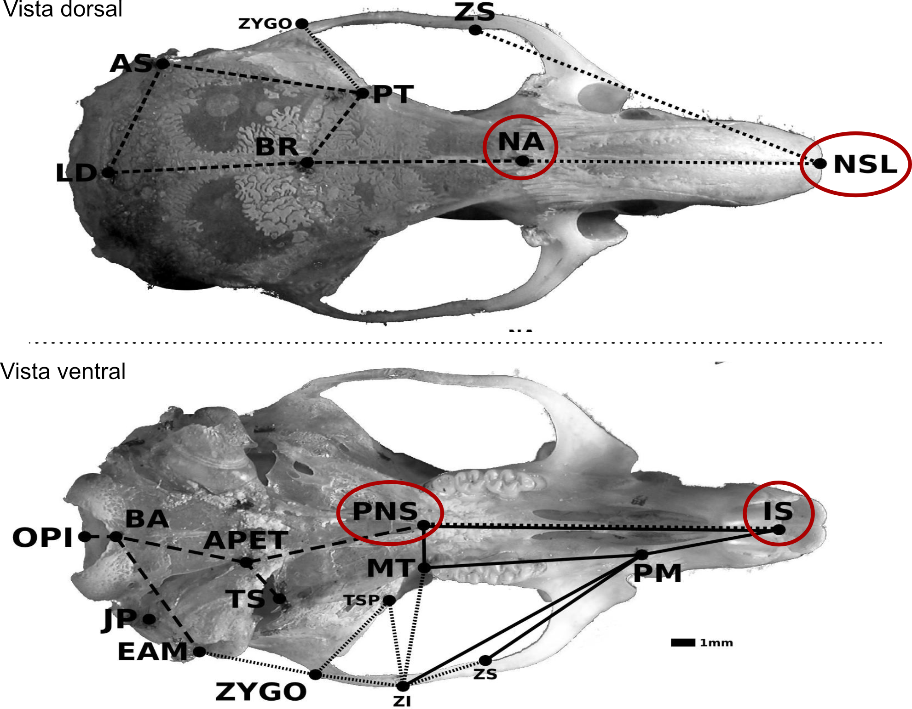

```{r setup, echo=FALSE}
library(rmarkdown)
knitr::opts_chunk$set(eval = TRUE)
# clipboard
htmltools::tagList(
  xaringanExtra::use_clipboard(
    button_text = "Copy code <i class=\"fa fa-clipboard\"></i>",
    success_text = "Copied! <i class=\"fa fa-check\" style=\"color: #90BE6D\"></i>",
    error_text = "Not copied 😕 <i class=\"fa fa-times-circle\" style=\"color: #F94144\"></i>"
  ),
  rmarkdown::html_dependency_font_awesome()
  )
```

# Modelos lineares simples

A regressão linear impõe ou presume que exista uma relação linear entre uma ou mais variáveis preditoras $x_i$ e uma variável resposta $y$.

$$
\begin{aligned}
y_i &\sim Normal(\mu_i, \sigma) \\
\mu_i &= \alpha + \beta x_i
\end{aligned}
$$

A primeira linha desse modelo descreve a distribuição de probabilidade da variável $y$. Ela pode ser modelada como uma variável com uma distribuição normal, com uma média $\mu$ e um desvio-padrão $\sigma$.

A segunda linha do modelo relaciona as variáveis preditoras X com a média esperada μ (mu), baseada numa relação causal hipotetizada entre X e Y. Nesse caso simples, a relação é linear e pode ser representada por uma linha que é dada pelos parâmetros de intercepto α (alfa) e de inclinação β (beta).

## Gerando um conjunto de dados.

Para esse tutorial introdutório, vamos utilizar dados simulados, de forma que conheçamos a relação real entre as variáveis X e Y.

```{r create_dataset}
N = 30
x <- runif(N, 0, 5)
n <- length(x)
mu <- 1.2 + 3.5 * x # α = 1.2 e β = 3.5.
y <- rnorm(N, mean = mu, sd = 3)
lm_data <- data.frame(x,  mu, y, res = y - mu)
```

Um gráfico simples para os dados:

```{r plot, fig.asp=1}
plot(y ~ x, pch = 19)
```

Como podemos ver no gráfico, parece haver uma relação linear simples entre as duas variáveis, como previsto pela simulação.

## Derivando os coeficiente de regressão linear usando OLS

Podemos estimar o valor dos parâmetros alfa e beta usando muitos métodos diferentes. O método mais comum é o Ordinary Least Squares (OLS), que produz soluções analíticas para o valor desses dois coeficientes.

Para encontrar esses coeficientes, o método OLS escolhe os valores de
$\alpha$ e $\beta$ que minimizam a soma dos quadrados dos resíduos:

$$
Q(\alpha, \beta) = \sum_{i=1}^{n} (y_i - \alpha - \beta x_i)^2.
$$

No mínimo, as derivadas de $Q$ em relação a cada parâmetro são iguais a
zero. Derivando em relação a $\alpha$, obtemos:

$$
\frac{\partial Q}{\partial \alpha}
= -2\sum_{i=1}^{n}(y_i - \alpha - \beta x_i) = 0,
$$

o que implica $\bar{y} = \alpha + \beta\bar{x}$. Portanto, uma vez
conhecida a inclinação, o intercepto é:

$$
\hat{\alpha} = \bar{y} - \hat{\beta}\bar{x}.
$$

Derivando em relação a $\beta$, obtemos a segunda condição de primeira
ordem:

$$
\frac{\partial Q}{\partial \beta}
= -2\sum_{i=1}^{n}x_i(y_i - \alpha - \beta x_i) = 0.
$$

Substituindo $\alpha = \bar{y} - \beta\bar{x}$ e isolando $\beta$,
encontramos a inclinação:

$$
\hat{\beta} =
\frac{\sum_{i=1}^{n}(x_i-\bar{x})(y_i-\bar{y})}
  {\sum_{i=1}^{n}(x_i-\bar{x})^2}
= \frac{\operatorname{Cov}(x,y)}{\operatorname{Var}(x)}.
$$


```{r beta0 and beta1, results='hide'}
beta_hat <- sum((x - mean(x)) * (y - mean(y))) / sum((x - mean(x)) ^ 2)
beta_hat

# Esta é apenas a razão entre a covariância de x e y e a variância de x
cov(x, y) / var(x)

# Como mu = alpha + beta*x:
alpha_hat <- mean(y) - beta_hat * mean(x)
alpha_hat
```

Confira as estimativas: $\hat{\beta}$ ficou próximo de 3.5 e
$\hat{\alpha}$ de 1.2, valores usados na simulação? Por que elas não
precisam ser exatamente iguais? 

Usando esse valor dos parâmetros, podemos incluir a reta de regressão no gráfico que fizemos acima.

```{r OLS, fig.asp=1}
plot(y ~ x, pch = 19)
abline(a = alpha_hat, b = beta_hat, col = 2, lwd = 2)
```

## Usando a função lm() para ajustar o modelo

Claro que não precisamos calcular os parâmetros diretamente. Podemos usar uma função do R para ajustar esse modelo linear. Essa função é a função "lm" e pode ser chamada usando a sintaxe de fórmula do R.

```{r, results='hide'}
m1 = lm(y ~ x)
m1
```

Compare os coeficientes impressos pelo `lm()` com os calculados acima.

Com o modelo ajustado, podemos usar a função "summary" para ver as estimativas dos coeficientes, que devem ser idênticas às que obtivemos acima, e também a sua significância e várias outras informações úteis.

```{r, results='hide'}
summary(m1)
```

## Premissas da regressão linear (opcional)

Muitos cursos dedicam bastante tempo às premissas dos modelos, embora nem sempre deixem claro o que elas significam. Aqui, não vamos nos deter numa discussão extensa sobre o tema. Em vez disso, vamos nos concentrar em verificar se os modelos recuperam os aspectos dos dados que nos interessam. Ainda assim, vale examinar as premissas da regressão linear e entender quais resultados podemos deduzir a partir delas.

Para interpretar os coeficientes e quantificar a incerteza das estimativas,
precisamos explicitar algumas premissas. Escrevemos o modelo como

$$
y_i = \alpha + \beta x_i + \varepsilon_i,
$$

em que $\varepsilon_i$ representa a parte de $y_i$ que não é explicada por
$x_i$. As premissas abaixo descrevem como essa parte não explicada se
comporta.

1. **Relação linear nos parâmetros.** A média de $y_i$, dado $x_i$, é
  representada por uma reta:

  $$
  E(y_i \mid x_i) = \alpha + \beta x_i.
  $$

  Isso não exige que os dados caiam exatamente sobre a reta. As diferenças
  entre as observações e suas médias são representadas pelos resíduos
  $\varepsilon_i$.

2. **Amostra aleatória.** As observações $(x_i, y_i)$ são obtidas por uma
  amostragem aleatória. Assim, uma observação não determina o erro de outra;
  essa condição permite tratar as observações como independentes no modelo.

3. **Variação em $x$.** Os valores de $x$ não são todos iguais:

  $$
  \sum_{i=1}^{n}(x_i - \bar{x})^2 > 0.
  $$

  Sem variação em $x$, não há como distinguir uma inclinação $\beta$ de
  uma mudança no intercepto $\alpha$.

4. **Média condicional do erro igual a zero.** Condicionalmente aos
  valores observados de todos os preditores, os erros têm média zero:

  $$
  E(\varepsilon_i \mid x_1, \ldots, x_n) = 0.
  $$

  Essa condição diz que o modelo não erra sistematicamente para cima ou
  para baixo em nenhuma região de $x$. 
  
  Com essas quatro premissas, podemos mostrar que as estimativas obtidas pelo método OLS (ou MLE) são não enviesadas[^sem-vies][^tradeoff]. De fato,
  usando $y_i = \alpha + \beta x_i + \varepsilon_i$ na fórmula da
  inclinação,

  $$
  \hat{\beta}
  = \frac{\sum_{i=1}^{n}(x_i - \bar{x})(y_i - \bar{y})}
       {\sum_{i=1}^{n}(x_i - \bar{x})^2}
  = \beta +
    \frac{\sum_{i=1}^{n}(x_i - \bar{x})\varepsilon_i}
       {\sum_{i=1}^{n}(x_i - \bar{x})^2}.
  $$

  Tomando a esperança condicional aos valores observados de $x$, o segundo
  termo tem esperança zero. Portanto,
  $E(\hat{\beta} \mid x_1, \ldots, x_n) = \beta$. Como
  $\hat{\alpha} = \bar{y} - \hat{\beta}\bar{x}$, também temos
  $E(\hat{\alpha} \mid x_1, \ldots, x_n) = \alpha$.

1. **Homoscedasticidade.** A variância dos erros é a mesma para todos os
  valores de $x$:

  $$
  \operatorname{Var}(\varepsilon_i \mid x_i) = \sigma^2.
  $$

  Com erros independentes e essa variância constante, a variância da
  inclinação estimada é $\operatorname{Var}(\hat{\beta} \mid x) =
  \sigma^2 / \sum_i (x_i - \bar{x})^2$. A homoscedasticidade permite
  estimar $\sigma^2$ sem viés usando a soma dos quadrados dos resíduos
  dividida por $n - 2$; os dois graus de liberdade[^gdl] correspondem aos
  parâmetros $\alpha$ e $\beta$ estimados.

Por fim, às vezes assumimos também que os erros têm distribuição normal:

$$
\varepsilon_i \mid x_1, \ldots, x_n \sim \mathcal{N}(0, \sigma^2).
$$

Essa premissa não é necessária para calcular os coeficientes OLS nem para
que sejam não enviesados. Ela permite obter distribuições exatas para as
estatísticas usadas em testes de hipóteses e intervalos de confiança em
amostras finitas. Aqui, quando falamos em normalidade, estamos nos
referindo aos erros do modelo, não exigindo que os resíduos observados
sejam perfeitamente normais.

# Resíduos da regressão

Uma vez que o modelo está ajustado, podemos calcular os seus resíduos ($e_i$). Ao invés de tratarmos os resíduos simplesmente como "erros", vamos tratar esses valores como a **variação residual não explicada pela variável preditora**.

Matematicamente, o resíduo para a observação $i$ é a diferença entre o valor observado ($y_i$) e o valor ajustado pelo modelo ($\hat{\mu}_i$):

$$e_i = y_i - \hat{\mu}_i$$

Podemos extrair essa variação não explicada diretamente do nosso modelo ajustado no R usando funções nativas:

```{r extract_residuals}
# Extraindo os valores ajustados (a porção de y explicada por x)
mu_hat <- fitted(m1)

# Extraindo os resíduos (a variação residual não explicada)
res <- residuals(m1)

```

Para entender o poder dessa extração, precisamos visualizar os resíduos de duas perspectivas complementares. A primeira delas é a perspectiva geométrica, pela qual enxergamos o resíduo como a distância vertical entre o dado observado e a reta de regressão.

```{r plot_res_distance, fig.asp=1}
# 1. Visualizando os resíduos como distância da reta
plot(y ~ x, pch = 19, main = "Perspectiva 1: Distância da reta de regressão")
abline(m1, col = "red", lwd = 2)

# Desenhando linhas conectando os pontos reais aos valores preditos
segments(x0 = x, y0 = y, x1 = x, y1 = mu_hat, col = "blue", lty = 2)

```

A segunda perspectiva é muito mais poderosa para nossos usos: podemos isolar essas distâncias (as linhas azuis tracejadas do gráfico acima) e tratá-las como uma nova variável: os valores de y descontados os efeitos de x.

```{r plot_res_variable, fig.asp=1}
# 2. Visualizando os resíduos como uma variável independente
plot(res ~ x, pch = 19, col = "blue", 
     main = "Perspectiva 2: A variação residual como variável",
     ylab = "Variação residual não explicada")
abline(h = 0, col = "red", lwd = 2, lty = 2)

```

Confira se os resíduos ficam em torno de zero e se ainda aparece algum
padrão em função de $x$. O que isso sugere sobre a adequação da reta?
Compare os dois gráficos: no segundo, os resíduos correspondem às
distâncias verticais do primeiro, agora representadas em torno de zero.
Ao subtrair de cada observação o valor previsto pela reta de regressão, 
a reta passa a coincidir com o eixo horizontal no gráfico de resíduos.

Entender os resíduos como uma variável própria, limpa da influência de um preditor específico, é o que nos permitirá usar a regressão como uma ferramenta de controle estatístico. Mais à frente neste tutorial, usaremos essa  propriedade para descontar nossas variáveis de interesse de fontes de variação espúria.

## Variáveis preditoras discretas

Caso a variável preditora X não seja contínua, o modelo linear pode ser usado da mesma maneira. Vamos simular dados em que a variável resposta Y represente o peso de um indivíduo e a variável X seja o estado nutricional: bem alimentado ou mal alimentado.

```{r}
set.seed(1)
# 1. Criar a variável preditora X (Categórica)
n <- 100
estado_nutricional <- sample(c("bem_alimentado", "mal_alimentado"), n, replace = TRUE)
peso_medio_por_classe = c("bem_alimentado" = 75, "mal_alimentado" = 60)
peso <- peso_medio_por_classe[estado_nutricional] + rnorm(n, mean = 0, sd = 5)

# Criar o dataframe
dados <- data.frame(peso, estado_nutricional)
head(dados)
```

Agora vamos ajustar um modelo linear e tentar capturar a diferença nas médias nessas duas classes.

```{r, results='hide'}
m2 = lm(peso ~ estado_nutricional)
summary(m2)
```

Na saída, identifique a categoria de referência e o coeficiente que
representa a diferença entre as médias. O sinal e a magnitude desse
contraste fazem sentido diante dos valores simulados de 75 kg e 60 kg?

Nesse caso, o modelo retorna um coeficiente chamado contraste, que expressa a diferença entre as médias dos indivíduos bem alimentados e mal alimentados. Confira o sinal e a magnitude desse coeficiente no `summary` e compare-os com o boxplot abaixo.

```{r, message = FALSE, warning = FALSE}
# install.packages( "ggplot2") # se necessario...
library(ggplot2)

ggplot(dados, aes(estado_nutricional, peso, color = estado_nutricional)) + geom_boxplot() + geom_jitter(width = 0.1)  
```

O coeficiente beta representa a diferença na média desses dois conjuntos de observações. 

**Pergunta: Qual seria a estrutura dos resíduos dessa regressão?**

# Regressão múltipla

Nós podemos estender a regressão linear para mais de uma variável preditora. Nesse caso, a média esperada de Y é uma função linear de mais de uma variável X.

$$
\begin{aligned}
y_i &\sim Normal(\mu_i, \sigma) \\
\mu_i &= \alpha + \sum \beta_j x_{ij}
\end{aligned}
$$

## Relação entre regressão múltipla e simples

A relação entre os coeficientes da regressão múltipla e da regressão simples depende da relação entre as variáveis X. Quando as variáveis X são não correlacionadas, os coeficientes da regressão múltipla e da regressão simples são idênticos.

Vamos fazer um exemplo simulado para entender isso. Primeiro, vamos simular duas variáveis preditoras não correlacionadas, chamadas x e z.

```{r}
set.seed(1)
n = 100
# Duas preditoras, x e z
x = rnorm(n)
z = rnorm(n)

# y é função de x e z.
a = 1; b_x = 1.35; b_z = 3.5
y = a + b_x * x + b_z * z + rnorm(n)
```

Primeiro, vamos olhar para os coeficientes das regressões simples, de y em x, depois de y em z.

```{r, results='hide'}
lm(y ~ x) |> coefficients() |> round(2)
lm(y ~ z) |> coefficients() |> round(2)
```

Confira os coeficientes: eles estão próximos dos valores usados na
simulação ($1.35$ para $x$ e $3.5$ para $z$)?

Finalmente, vamos olhar para os coeficientes da regressão múltipla, ajustando coeficientes para X e Y simultaneamente.

```{r, results='hide'}
lm(y ~ x + z) |> coefficients() |> round(2)
```

Compare esses coeficientes com os das regressões simples. Eles mudaram
muito? Com preditores não correlacionados, esperamos que as estimativas
simples e múltiplas sejam próximas, embora não necessariamente idênticas
em uma amostra finita.

## Preditores correlacionados na regressão múltipla

A situação muda quando os preditores são correlacionados. Vamos simular um exemplo em que X e Z são ambos causados por uma mesma variável não observada U.

```{r}
set.seed(2)
n = 100
u = rnorm(n)

# X e Z são funções de u?
x = 1 + 0.5 * u + rnorm(n)
z = 3 + 2   * u + rnorm(n)

# y é função de x e z.
a = 1; b_x = 1.35; b_z = 3.5
y = a + b_x * x + b_z * z + rnorm(n)
```

Agora, vamos novamente olhar para os coeficientes da regressão simples de Y em X e de Y em Z.

```{r, results='hide'}
lm(y ~ x) |> coefficients() |> round(2)
lm(y ~ z) |> coefficients() |> round(2)
```

Confira agora as regressões simples: os coeficientes ainda estão
próximos dos valores usados na simulação ($b_x = 1.35$; $b_z = 3.5$)?
Compare com o exemplo anterior. O que mudou entre os dois cenários?

Mas, se incluirmos tanto o X quanto o Z na regressão, conseguimos recuperar esses valores simulados.

```{r, results='hide'}
lm(y ~ x + z) |> coefficients() |> round(2)
```

Compare as estimativas múltiplas com os valores usados para gerar os
dados. Incluir as duas variáveis ajuda a recuperar seus efeitos
simulados?

## Recuperando os coeficientes da regressão múltipla usando residuos

Lembra-se de quando definimos os resíduos como a *variação residual não explicada* e vimos que poderíamos usá-los como uma nova variável independente? 

Podemos reproduzir os coeficientes da regressão múltipla usando apenas regressões simples, aplicando o conceito de resíduos. Para descobrir o efeito isolado de $x$ sobre $y$ (descontando $z$), precisamos primeiro descontar o efeito de $z$ na variável $x$.

Podemos fazer isso em três passos:

1. Ajustamos um modelo em que $x$ é a variável resposta e $z$ é a preditora.
2. Extraímos os resíduos dessa regressão. Essa nova variável representará a variação de $x$ que é independente de $z$.
3. Ajustamos um novo modelo simples de $y$ contra esses resíduos de $x$.

Vamos ver isso em código:

```{r, results='hide'}
# 1. Regredimos a variável X contra a variável Z
m_xz <- lm(x ~ z)

# 2. Extraímos os resíduos (a variação de X que não tem relação com Z)
res_x <- residuals(m_xz)

# 3. Regredimos Y contra esse X residual
lm(y ~ res_x) |> coefficients() |> round(2)

```

Compare o coeficiente de `res_x` com o coeficiente de $x$ em
`lm(y ~ x + z)`. Eles são iguais, salvo diferenças de arredondamento?

Podemos fazer exatamente o mesmo procedimento para isolar o efeito de $z$ sem a influência de $x$:

```{r, results='hide'}
# Isolando Z: regredimos Z em função de X e extraímos os resíduos
res_z <- residuals(lm(z ~ x))

# Regredimos Y contra o Z residual
lm(y ~ res_z) |> coefficients() |> round(2)

```

Faça a mesma comparação para `res_z` e o coeficiente de $z$ no modelo
múltiplo. O resultado confirma o padrão observado para `res_x`?

Esse processo ilustra o [Teorema de Frisch-Waugh-Lovell](https://en.wikipedia.org/wiki/Frisch%E2%80%93Waugh%E2%80%93Lovell_theorem): a regressão múltipla não é nada além de uma série de regressões simples nas quais o efeito de cada variável preditora é estimado usando apenas a parte da sua variação que é única e não compartilhada com os demais preditores do modelo.

## Controlando efeitos espúrios

Essas propriedades da regressão múltipla são usadas no contexto de genética quantitativa para remover fontes de variação que não são relevantes para o estudo em questão.

Vamos usar um exemplo com dados reais: o conjunto de dados **ratones**, que contém medidas cranianas de 5 populações experimentais de camundongos (https://onlinelibrary.wiley.com/doi/full/10.1111/evo.13304).

```{r}
ratones <- read.table("https://raw.githubusercontent.com/diogro/evofencom/refs/heads/main/Tutoriais/ratones.tsv", header = TRUE)
```

Esse é um conjunto de dados relativamente grande.

As primeiras colunas representam variáveis categóricas, como:

- ID de cada indivíduo
- O sexo de cada indivíduo
- A qual geração o indivíduo pertence
- A qual linhagem ele pertence
- O ID da mãe e do pai do indivíduo
- A idade do indivíduo em dias
- Qual linhagem ele pertence
- Qual o peso dele aos 49 dias

E a partir da coluna IS_PM até a coluna BA_OPI, temos as distâncias cranianas em milímetros.

Este resultado é extenso e está oculto. Execute o bloco e confira: quantas
observações e variáveis há? Quais colunas são categóricas e quais contêm
medidas cranianas?

```{r, results='hide'}
str(ratones)
```

Nosso objetivo é estimar a correlação fenotípica entre um par de variáveis cranianas: o comprimento do osso nasal e o comprimento do palato, dados pelas variáveis NSL_NA e IS_PNS.

```{r label = distances, echo = FALSE, fig.cap = "Vista ventral e dorsal de um crânio de roedor, com os pontos envolvidos no cálculo das distâncias de interesse circulados em vermelho", out.width = "100%"}

```

Vamos começar onde devemos começar sempre, **com uma visualização dos dados**. Vamos fazer um gráfico da relação entre essas duas variáveis, usando cores e símbolos para visualizar os fatores de confusão: sexo e linhagem.

```{r, warning=FALSE}
ggplot(ratones, aes(NSL_NA, IS_PNS, color = SEX, shape = line, group = line)) + 
  geom_point() + stat_ellipse() + scale_color_manual(values = 1:2) + theme_classic()
```

Parece haver uma relação entre as duas variáveis; porém, diferenças nas médias entre sexos e linhagens também são aparentes. As elipses estão desenhadas ao redor de cada linhagem, e podemos ver que a média das duas variáveis parece ser diferente em muitas das linhagens.

Antes de usar o modelo linear para controlar esses efeitos espúrios, vamos calcular a correlação bruta, sem nenhuma correção, entre as duas variáveis.

Anote a correlação bruta antes de seguir. Ela indica uma associação
positiva ou negativa, e quão forte parece ser?

```{r, results='hide'}
x = ratones$NSL_NA
y = ratones$IS_PNS
cor(x, y)
```

Agora, vamos usar um modelo linear para criar um conjunto de dados residual, removendo os efeitos de sexo e linhagem.

```{r}
traits = names(ratones)[12:46]
f = paste0("cbind(", paste(traits, collapse = ","), ") ~ SEX + line") 

# Replicando o formato original dos dados.
ratones_res = ratones 

# Substituindo as medidas pelos resíduos de um modelo linear, incluindo sexo e linhagem.
ratones_res[, traits] = lm(as.formula(f), data = ratones) |> residuals()
```

Esse novo conjunto de dados residual pode ser usado para fazer o mesmo gráfico que fizemos anteriormente, e calcular a mesma correlação.

```{r, warning=FALSE}
ggplot(ratones_res, aes(NSL_NA, IS_PNS, color = SEX, shape = line, group = line)) + 
  geom_point() + stat_ellipse() + scale_color_manual(values = 1:2) + theme_classic()
```

Veja como agora as elipses estão todas sobrepostas: as diferenças nas médias foram removidas pelo modelo linear.

Podemos, então, calcular a correlação entre essas duas medidas, descontando os efeitos dessas variáveis de confusão.

```{r, results='hide'}
x = ratones_res$NSL_NA
y = ratones_res$IS_PNS
cor(x, y)
```

Compare este valor com a correlação bruta calculada antes. Ela aumentou
ou diminuiu após controlar sexo e linhagem? Qual aspecto dos dados pode
explicar essa mudança?

A correlação, descontadas as variáveis de confusão, é sensivelmente maior do que o valor que havíamos calculado anteriormente. O efeito das variáveis espúrias (sexo e linhagem) estava reduzindo o valor da correlação bruta nos dados. Sem essa correção, nós estaríamos calculando uma correlação que não corresponde às relações fenotípicas encontradas dentro dessas populações.

# Incluindo interações no modelo

Uma interação permite que a relação entre uma variável preditora e a
resposta mude conforme o valor de outra variável preditora. Por exemplo,
podemos investigar se a relação entre a umidade do solo (`water`) e o
número de flores (`blooms`) depende da quantidade de sombra (`shade`),
usando o conjunto de dados `tulips`.

## Preparando os dados

Vamos dividir `blooms` pelo seu valor máximo e centralizar `water` e
`shade` em torno de suas médias. Assim, os coeficientes principais ficam
mais fáceis de interpretar.

```{r tulips_data}
tulips <- read.csv("tulips.csv")
tulips$blooms <- tulips$blooms / max(tulips$blooms)
tulips$water <- as.numeric(scale(tulips$water, scale = FALSE))
tulips$shade <- as.numeric(scale(tulips$shade, scale = FALSE))
```

## Ajustando o modelo

Na fórmula do R, `water * shade` inclui os efeitos de `water` e `shade`,
além da interação entre eles. O modelo pode ser escrito como

$$
E(\text{blooms}_i) = \beta_0 + \beta_1\,\text{water}_i
  + \beta_2\,\text{shade}_i
  + \beta_3\,\text{water}_i\,\times\text{shade}_i.
$$

O coeficiente $\beta_3$ descreve como a inclinação da relação entre
`water` e `blooms` muda com `shade`: para um valor de sombra $s$, essa
inclinação é $\beta_1 + \beta_3 s$.

Na saída do modelo, confira o sinal da estimativa de `water:shade`.
Como esse sinal se relaciona com as inclinações das retas no gráfico?

```{r fit_interaction}
m3 <- lm(blooms ~ water * shade, data = tulips)
```

O resumo mostra as estimativas dos efeitos principais e da interação:

```{r summarize_interaction, results='hide'}
summary(m3)
```

## Visualizando a interação

As retas abaixo mostram os valores previstos pelo modelo para cada nível
de `shade`, mantendo os demais termos conforme a fórmula ajustada.

```{r visualize_interaction}
plot(blooms ~ water, col = 2:4, pch = 16, data = tulips)
for (s in unique(tulips$shade)) {
  abline(
    a = coef(m3)["(Intercept)"] + coef(m3)["shade"] * s,
    b = coef(m3)["water"] + coef(m3)["water:shade"] * s,
    col = match(s, sort(unique(tulips$shade))) + 1
  )
}
legend("topleft", legend = c("Sombra -1", "Sombra 0", "Sombra 1"), col = 2:4, pch = 16)
```

Confira o gráfico: a inclinação muda entre os níveis de sombra? Esse
padrão é compatível com o coeficiente de interação observado em
`summary(m3)`? Pense na história que esse modelo conta. Ela faz sentido?

[^sem-vies]: Um estimador é não enviesado quando sua esperança, em repetições do processo amostral, coincide com o parâmetro que estima. Neste caso, as igualdades demonstradas são condicionais aos valores de $x$. Note que essa definição depende de uma distribuição de valores hipotéticos dos dados.

[^tradeoff]: Não se deixe levar pela carga emocional associada ao termo. “Não enviesado” descreve uma propriedade do estimador, mas não significa, por si só, que ele seja o melhor. Um estimador com algum viés pode variar menos entre amostras e, por isso, ter erro quadrático médio menor. Por exemplo, em uma amostra pequena, aceitar um viés modesto pode reduzir bastante a variância do estimador e, com isso, seu erro quadrático médio. Portanto, a escolha do estimador depende do objetivo e do custo relativo de viés e variabilidade. “Não enviesado” não é um selo universal de qualidade. Veja, por exemplo: [James-Stein Estimador](https://en.wikipedia.org/wiki/James%E2%80%93Stein_estimator) ([video](https://www.youtube.com/watch?v=cUqoHQDinCM))

[^gdl]: Na regressão linear simples com intercepto e inclinação, os resíduos $e_i = y_i - \hat{y}_i$ não podem variar livremente: as equações que definem o ajuste por mínimos quadrados impõem $\sum_i e_i = 0$ e $\sum_i (x_i - \bar{x})e_i = 0$. Essas duas restrições deixam os resíduos em um espaço com $n - 2$ dimensões. Por isso, embora haja $n$ resíduos, a soma de seus quadrados é dividida por $n - 2$ para obter um estimador não enviesado de $\sigma^2$, sob as premissas do modelo. Esse é o sentido de “graus de liberdade residuais” neste trecho: a quantidade de informação independente que resta para estimar a variância depois de ajustar os dois coeficientes. Em uma abordagem Bayesiana, os coeficientes e a variância são tratados como parâmetros incertos, recebem distribuições a priori e são atualizados pela distribuição posterior. Assim, a incerteza costuma ser descrita diretamente pela posterior, e não por uma correção frequentista universal que divide a soma dos quadrados por $n - 2$. 
